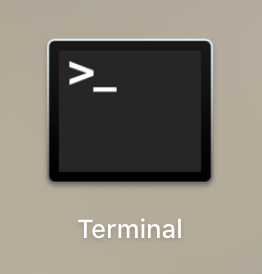
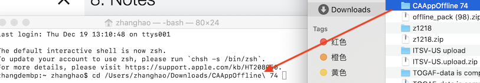
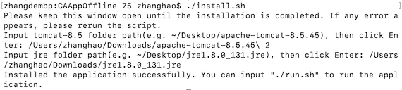
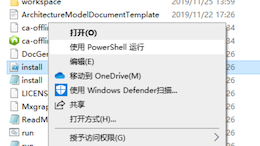
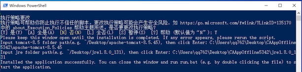
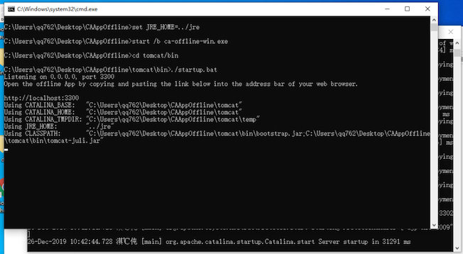
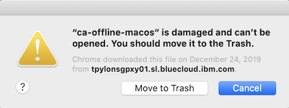
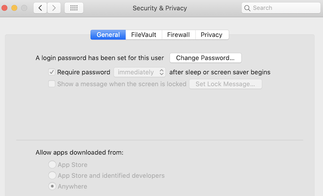

## Welcome to IBM IT Architect Assistant Community Edition!

The introduction is organized in the following sections:
- [What is it?](#what-is-it)  
- [How to get it?](#how-to-get-it) 
- [Prerequisite](#prerequisite)
- [Supported Browsers](#supported-browsers)  
- [Installation](#installation)
- [Running](#running)
- [Guide](#guide)
- [License](#license) 
- [How to create issues and contact us?](#how-to-create-issues-and-contact-us) 

### What is it?

**IBM IT Architect Assistant, Community Edition®** is a tool that supports the creation and documentation of IT  Solution Architectures. It is a simple tool to assist an Architect in designing a solution by reusing high quality architectural solutions (e.g. those found in the IBM Cloud Architecture Center - https://www.ibm.com/cloud/garage/architectures) and/or patterns and customizing them for specific project or initiative.

The key features of **IBM IT Architect Assistant, Community Edition®** are:
* A personal workspace where users can manage the solution architectures they are working on. An architecture can be created from scratch or can be created by copying an existing architecture asset.
* Each architecture (asset) is structured in a standard form allowing for consistent documentation and reuse. Individual artifacts can be easily added and customized for the user’s solutions.

Key Benefits and savings from using **IBM IT Architect Assistant, Community Edition®**:

* Reduce time for creating architectures through tool simplicity and easy reuse of existing architectural assets.
* Improve Quality through consistency by reusing proven solution alternatives.

### How to get it？

Currently, the community edition is provided via a zip file in Github for downloading. After **downloading**, **unzipping** and **installing**, you can use it on your local system.

### Prerequisite

1. This application currently supports the following systems. Check if your system is compatible, older systems may encounter unpredictable bugs.
  - MacOS 10.12+
  - Windows 10
2. This application is dependent on several third-party tools, and it will install these when installing. Please **confirm you have permission to use below tools**. If you are not permitted, there are some risks to run the application on your system.
  - [Tomcat V8](https://tomcat.apache.org/tomcat-8.5-doc/)
  - [Java SDK V8](https://www.oracle.com/technetwork/java/javase/downloads/jdk8-downloads-2133151.html)
3. The application needs you to confirm some operations when installing and running, such as inputting system password to work on system path, inputting 'Y' for using commands, permitting the network access for the application, please ensure that these operations are permitted within your organization, otherwise the application is unavailable.

### Supported Browsers

The application currently supports **Chrome 32+** and **Firefox 38+**. Other browsers, e.g. IE and Safari can execute most operations, but there may be some small bugs or defective UIs.

### Installation

1. Download and decompress tomcat 8.5 & JRE 8/9 into a local path(e.g. ~/Desktop) manually if you haven't installed them before (you may find them in https://tomcat.apache.org/download-80.cgi, https://www.oracle.com/technetwork/java/javase/downloads/java-archive-javase8-2177648.html, https://jdk.java.net/archive or some search engines):
    * MacOS:
      - apache-tomcat-8.5.*.tar.gz
      - jre-**8/9**u*-macosx-x64.tar.gz(it's Oracle version, while openjdk 9.\*.\* is also available)
    * Windows:
      - apache-tomcat-8.5.*-windows-x64.zip
      - jre-**8/9**u*-windows-x64.tar.gz(it's Oracle version, while openjdk 9.\*.\* is also available)

2. Install the community edition application via CLI:

    * If you use **MacOS**, install by below steps:

        2.1 open Terminal:

        

        2.2 execute below scripts, the yourAppPath(tomcat/jre path) can be inputted by dragging like below picture:
        ```
        cd {yourAppPath}
        ./install.sh
        ```

        

        2.3 Input your tomcat and jre path by the prompts.

        

    * If you use **Windows**, run **install.ps1** with PowerShell(e.g. by right clicking). Then input your tomcat and jre path. You may need to input 'Y' when running the shell, please refer to [Prerequisite 3](#prerequisite).

        
        

If you see 'Installed the application successfully.' in the CLI window, then the installation is successful, you can close it and do the running process. If there are error messages, you need to confirm whether the folder path is right.

### Running

Launch the community edition application via CLI:

  * If you use **MacOS**, use Terminal to execute:
    ```
    cd {yourAppPath}
    ./run.sh
    ```

      
  
  * If you use **Windows**, run **run.bat** directly(e.g. by double clicking the file).

      

After the popup windows don't have new outputs, you can access the application by inputting http://localhost:3300/workspace in your browser. You may need to confirm open new network access, please refer to [Prerequisite 3](#prerequisite).

### Guide

There is an [operation guide](docs/Overview-ITAA-CE.md) and an [artifact guide](docs/Artifact-Details-ITAA-CE.md) that provide guidance for basic operation of the tool along with more detailed information around the creation and manipulation of specific architecture artifacts.

### License

Please see [LICENSE](LICENSE) for more information.

### FAQ

There maybe some blocks when installing/running the application, here are some possible situations and solutions.
1. the app is damaged like below:

    

Solution: try to execute "xattr -cr ./ca-offline-macos" in Terminal.

2. the app can't be opened like below:

    

Solution: try to change the allowance in system config -> Security & Privacy, select the 2nd or 3rd allowance.

  

### How to create issues and contact us?

If you have  problems using the community edition application, you can create a new issue in the **Issues** tab of our Github repository. We will check and give you a response.

If you have complex problems or have some ideas, you can contact us by email [cogarch@us.ibm.com](cogarch@us.ibm.com).
