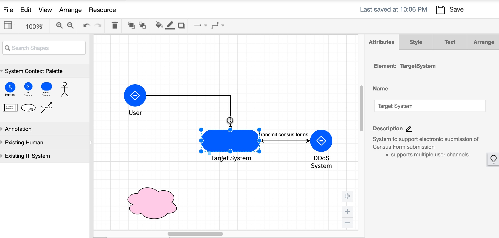
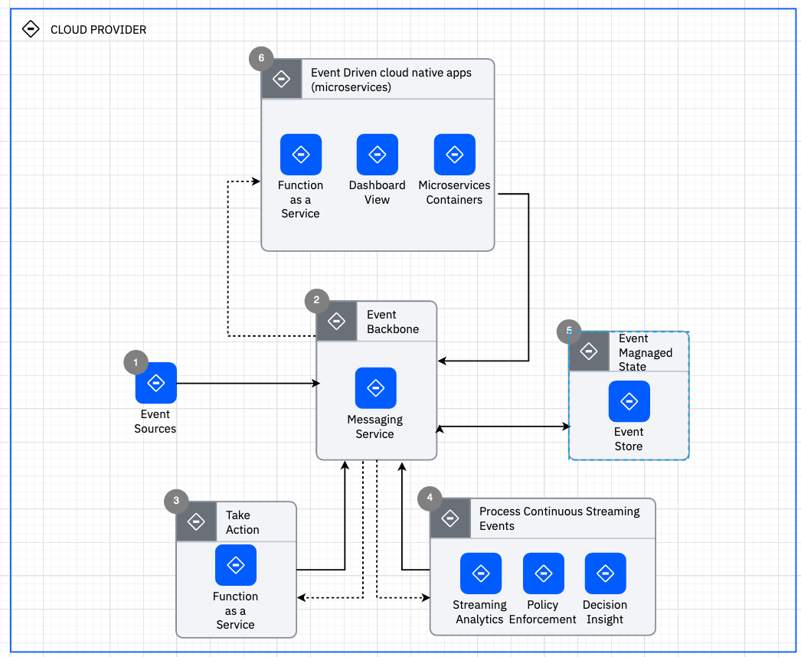

# IBM IT Architect Assistant, Community Edition User Guide
**IBM IT Architect Assistant, Community Edition** is a simple browser-based tool to assist an Architect in designing and customizing a solution.

The hosted, **IBM IT Architect Assistant** is both a solution model authoring tool as well as a searchable repository of authored solution architectures/models. The Community Edition is a single-user version of this tool.

The Documentation is organized in the following sections:
- [Terminology](#terminology)  
- [Getting Started](#getting-started) 
- [Workspace](#workspace-search-and-dashboard)
- [Architecture Cards](#architecture-card-elements)  
- [Workspace Details](#workspace---private-collaboration-and-bookmarks)
- [Basic authoring of architecture artifacts](#authoring)
- [Reuse, Copy and Paste](#copy-and-paste)
- [Export](#export)
- [Detailed authoring - by artifact type](./Artifact-Details-ITAA-CE.md) 

## Terminology
Before diving into details about IBM IT Architect Assistant, Community Edition it is important to understand some key terminology used throughout the documentation.  

**Artifact** -- An architecture (asset) is comprised of a set of artifacts that are typed. The standard set of artifacts are displayed in the architecture's Table of Contents (**TOC**). Many of the artifact types can have 0 to n **artifact instances**.  Examples of artifacts include Business Challenge, System Context, Functional Requirement, etc.  Most of the artifacts correspond to a technical work product.

**Shared Elements** -- The building blocks of an architecture are a set of architectural elements. Each of these elements have a specific type along with a set of attributes. Many of the architecture elements contribute to and are referenced within multiple artifacts and artifact instances. As such it is important that these elements are shared (i.e., by reference). The implication is that each shared element must have a unique name within the architecture. To enforce this constraint the tool will flag as an error anytime a new element is created and given a name already in use in the architecture.  This error forces the user to either bind to (reference) the currently existing shared element or if the user needs to reference a different architecture element, supply the new element with a unique name. For example, adding a new Logical Node to an AOD IT System View instance and giving it the name **Customer Service** when a Logical Node with that name already exists (perhaps on a different diagram instance) results in an error (duplicate name error). 

###### Bind to existing element

To resolve this the user can select the Logical Node in error and click on the **Select from existing** button (at the bottom of the Attributes tab of the Format panel) and point to the existing Logical Node, indicating you are reusing the same element. 

Alternatively a different (unique) name can be assigned. Either approach will remove the error.

------

Additional "big picture" tips about the tool can be reviewed in the [Common Tips](../../master/docs/CATips.md) document.

------

([Back to Top and TOC](#ibm-it-architect-assistant-community-edition-user-guide)) 

## Getting Started

### Help

Anywhere within the tool you can navigate to the appropriate section of this User Guide via the keyboard short-cut (**F1** or **fn-F1**)!

Getting started with IBM IT Architect Assistant, Community Edition involves authoring a new or existing architecture.  As a single-user environment, the only available assets are those that you author and those that you download and import.

One source for content to import are the reference architectures and reference solutions published on [IBM Cloud Architecture Center](https://www.ibm.com/cloud/architecture/architectures). You are strongly encouraged to work through the [self-paced tutorial](./Self-Guided%20Tutorial/Getting%20Started%20with%20IT%20Architect%20Assistant.md) which has you download an architecture from this site and install it into your local workspace.

In your local installation of the Community Edition, you will find the **Workspace** folder. Within this folder there are subfolders, each representing a different architecture available locally within the tool.  

##### Import architecture

To add new architectures from an external source such as the IBM Cloud Architecture Center: 

1. Download an architecture archive file (.zip) 
2. Uncompress this archive file into the Workspace folder

After loading a new architecture into the workspace folder just **refresh** the Browser running community edition to see the architecture card show up on the offline workspace.

### Consistent architecture template

An architecture is comprised of a set of interrelated artifacts many of which share a set of elemental architecture building blocks (or elements). The best way to visualize this structure is through IBM Architect Assistant, Community Edition's Table of Contents for any architecture.

This standard structure directly supports the details of a specific solution architecture, but can also be used to manage a set architecture building blocks which are described as a **architecture pattern** within the tool.  This may be a library of reusable standard *parts* or a more integrated set of reusable content.  These *architecture patterns* typical get used as a source resource for copying a subset of the pattern asset into a target architecture.  This is useful to be able to consistently use these building blocks in multiple architecture

An architecture is what can be edited, copied or deleted. In IBM Architect Assistant, Community Edition, an architecture can be selected via a **card** that will appear in  your workspace. 

## Workspace
When a user connects to IBM Architect Assistant, Community Edition they land in their offline workspace.  

Here you can see the architectures you have loaded/authored on your local environment.  You also have the card to Add a new architecture. Click on the **Add Architecture Solution** and you will be prompted to supply a name for the architecture along with other optional meta-data. After supplying details, clicking on **Add** will create a new empty architecture.

### Architecture Card Elements

In all contexts an Architecture card has many of the same elements displayed. The architecture name is prominent on the top left with an "additional menu" identified via the ellipses **...** in the upper right corner. The color of the top half of the card along with the text and icon at the bottom of the colored section identify the type of asset. In the bottom half of the card (when you are not hovering over it), you will see a set of optional tags.

When you hover over an architecture card, the display changes.

The display will provide the architecture name and then two buttons, **Open** and **Quick View**. Clicking on **Quick View** opens up a summary panel on the right side of the browser. This quick view will include Type, Name, Tags, the Overview text and a list of the populated Artifacts.  If this is a private asset, the information about the owner will also be displayed.  The bottom of this Quick View is the **View Detail** button which performs the same operation as the **Open** button on the main card.

Clicking on **Open** will then open the architecture, displaying the Table of Contents (TOC) on the left side and the details of the selected artifact (selected in the TOC) in the main section. By default, the asset opens to the **Overview** artifact. 

([Back to Top and TOC](#ibm-it-architect-assistant-community-edition-user-guide)) 

### Workspace - Local

The Workspace is an area in which a set of Architectures, referenced by the user, can be located. In the Community Edition, all architectures are located on your local filesystem, thus the label of Local for the Workspace. The full hosted version of the tool, [IBM Architect Assistant](https://www.ibm.com/us-en/marketplace/architect-assistant?mhsrc=ibmsearch_a&mhq=Architect%20Assistant), presents 3 workspaces: Private, Collaboration and Bookmarks as this tool maintains a rich collaborative architecture repository

On each architecture card there is a set of options available to you on the "more" **...** menu. Always available on all architectures everywhere is **Copy**.  This requests a new copy of the architecture to be created, owned by the invoker. Scenarios for copying include implicit versioning or starting a new project with an initial starting point. In addition, as an owner of an asset you will have the ability to select **Delete** off of the same menu. 

([Back to Top and TOC](#ibm-it-architect-assistant-community-edition-user-guide)) 

## Authoring

If you have edit control, when you open the architecture you will be able to author any of the contained artifacts.  Earlier we showed the standard TOC for an architecture. Let's classify the individual artifacts to help setup common user experience for authoring. First, there are artifacts that have exactly one instance and thus edit them directly and another set of artifacts in which you will edit individual artifact instances. The Overview, Business Challenge, and System Context each only have a single instance. So when selecting these artifacts in the TOC, the directly editable content appear on the right side with the ability to **save** your changes. Both the Overview and Business Challenge are rich text based artifacts, so the "editor" is a lightweight rich text enabled text box. The System Context is a diagram and thus the editor is the tool's MxGraph-based diagram editor. All other artifacts support multiple instances, so selecting such an artifact (for example Functional Requirements) will lead to the right side being a list (card style) of the currently existing instances plus a card-like control (**Plus sign**) that you can click on to create a new instance.

Clicking on the Add instance button will prompt for the minimal set of properties to uniquely define the instance (usually just name, but sometimes also an id). From a basic user experience perspective, there are four types of artifacts and therefore artifact instance types: 1) Form-based text artifacts, 2) Free form text artifacts, 3) Diagram artifacts, and 4) a diagram overlay artifact. 

### Form-based text artifact types
The first type includes: Use Cases, Functional Requirements, Non-Functional Requirements, Architecture Decisions, Architecture Principles, Risk, Assumptions, Issues, and Dependencies.  These typically would be viewed outside the tool as tables each with a very specific structure (attributes) based on the information represented by the artifact type where each row (or record) corresponds to a single artifact instance. Since the editor is form-based, you will have individual fields (attributes) editable by their own UI control.  In some cases, an attribute value may be a reference to an architectural element, typically presented via a drop-down list.

### Free form text artifacts
The second type of artifact from a UI perspective includes **Notes**. Notes are intended to easily allow any miscellaneous content to be attached or associated with an architecture that otherwise doesn't have a structured artifact prescribed. Each Note is a standalone entity which includes Rich Text (including embedded images) along with file attachments. Here the editor is a specialized rich text editor. There is an option to create (manage) a set of labels or tags that can then be added to Notes. The visible Note instances can then be filtered based on the applied labels.

### Diagrams
The third type of artifact provides the richest user experience. These are specialized diagram types all of which are delivered by a custom *MxGraph-based* diagram editor. MxGraph is an open source framework that delivers client side JavaScript diagramming capabilities.

Above is a System Context diagram in IBM Architect Assistant, Community Edition. Let's look at the various parts of the editor. 

The top two rows include the menu and toolbar controls.  These are only present when the diagram is open in edit mode. If you are just viewing a diagram, these elements won't appear on screen (including the explicit save button). 

Next on the left hand side you will find a set of drawing palettes. These supply the elements that can be added to the drawing canvas (the main part of the editor and where the diagram resides). In IBM Architect Assistant, Community Edition, the top most palette will have a name that specifies the type of diagram, and includes all of the *architectural elements *that can be added to the diagram.  In this case the **System Context Palette** includes a Human Actor symbol, an IT System Actor symbol, a Target System symbol and a Connector symbol. Each of these symbols, when added to the diagram, will be associated with an architecture element (core model element) each of which have an associated set of attributes dependent on the element type. 

The attributes for a model element appear within the Attribute tab of the **format panel** typically visible to the right of the diagram (canvas).  For example, in the diagram above you see the purple IT System symbol, named DDoS System, selected. Since the selected item represents an architectural element, there is an Attributes tab on the format panel that displays the attributes of the associated architectural element. In this case the type of architectural element is an **Actor** with Name, *DDoS System*; Description, "*new description imported*"; and a Type of *IT System*.

In addition to the diagram specific palette, there will always be an *Annotation* palette.  This palette contains a set of common shapes. Adding a symbol from the annotation palette onto the diagram just adds that shape to the diagram. This shape is NOT associated with any architectural element.  Thus annotations are just used to add style to the diagram.

Below is the same System Context diagram, with the pink cloud shape selected. Note that the format panel only shows the Style, Text and Arrange tabs; the Attributes tab is missing.

#### Existing element palettes

Also available are a set of palettes that represent the reusable architecture elements available in the architecture that are appropriate for this artifact type.   In the example above you see **Existing Human** (actor) and **Existing IT System** (actor) palettes. Here you can easily drag an element that has been defined elsewhere in the architecture onto the diagram (for reuse).  

With the exception (currently) of Existing Nodes in AOD IT System View, dragging an existing element onto a diagram will use the default icon for the element type.  As of release 2.9, Logical Nodes in IT System views, will be associated with the icon you are using within your diagrams (and are visible as such on the Existing Nodes palette).

A few diagram types have additional palettes available beyond the diagram specific palette and the annotation palette. Those will be detailed in sections specific to those diagram types.

In general you add something from a palette onto the drawing canvas via a drag operation. Select a symbol and drag from the palette to where you want to place it on the canvas. If you just click on a symbol, the symbol will get added at a random location on the canvas. All non-line/connector symbols have a "bounding box" which includes anchor points where connections can be made by the endpoint of a line/connector symbol. When connecting the end of a connector to a symbol you will want to see a "green" connection dot or green bounding box outline appear before releasing the mouse to make the connection. Otherwise, you will have just moved the line's endpoint without accomplishing making a connection.

The start state for the above graphic is a connector (highlighted in red along with error message) whose one endpoint is not connected. The arrow head end has been grabbed using the mouse and the mouse moves over the edge of the target system. When positioned properly, you see the anchor points (the tiny blue 'x's), and the "hot green dot" shows a selected anchor is active. Releasing the mouse will make the connection (as per earlier version of the diagram) and the error will be removed.

#### Quick Connect
In the case of the System Context diagram (and many more of the diagram types), there is exactly one type of connector supported on the diagram. In these cases it is not necessary to explicitly drag the connector from the palette onto the canvas and then connect each end. Instead, with nothing selected on the diagram, hover the mouse over the bounding box for a symbol you which to have as the starting point for a connector. Once you get the green outline or green circle, click the mouse and then move over the boundary of the destination symbol. Once you get the destination symbol (outline or circle) to turn green, release the mouse.  This will add the connector while connecting it at the same time. 

#### Style and more
The MxGraph framework provides a rich set of formatting tools to help you make the diagram look however you would like. Many of these are self explanatory and are available directly in the 3 separate tabs of the **format panel**: Style, Text, and Arrange.  

The Style panel let's you apply style to whatever element is selected.  So if it is a line, the choice of line style (dash, solid), endpoint style (arrow type), thickness, color, etc.  You can also adjust whether the line is straight, curved, orthogonal jogs, etc.  Also if two lines are selected (which cross), you can set the style for the line crossing.  If the symbol is a shape then things like fill and outline color, etc are available to be changed. 

The style panel also includes an Edit Style button which provides access to the basic properties of the shape for instance the base shape type, whether it is a container, whether the shape is represented by an image (icon) - thus exposing an "edit image" control, etc. Knowledge of the "Edit Style" and the corresponding style commands are most important to be able to replace the style of one symbol with the basic style of some other symbol in the system. 

**Tip:** For instance, you might want to have your Target System represented by an image in the System Context diagram. One way to do this is copy the style from a Logical Node from an AOD IT System View and paste that into the Style for the Target System and then edit its image. This approach of identifying and applying a style from a symbol from any diagram to a different symbol in the same or different diagram type can universally be applied. 

The Text panel let's you modify the text properties for the selected item.  This includes things like positional alignment (vertical and horizontal), font family and size, bold, italics, and underline, word wrap, font color and background color.

The Arrange panel allows you to position the layering of stacked items (to front, to back), the size of symbols and the position relative to the canvas, and flip and rotate symbols. Of perhaps most value is being able to select multiple symbols and align and space them.

**Tip: Grouping** There are two separate approaches to "grouping" elements in diagrams: 1) containment (parent / child) and 2) Group.  You can define any symbol as being a container and optionally collapsible, for example Subsystem, Location, OMLocation.  This is done within the Style panel by clicking on **Edit Style** and  adding properties, "container=1;" and "collapsible=1;". Any symbol with container=1 will be highlighted when another symbol gets placed within it.  Then moving the parent (container) will move it along with all its contained children as a group.  You can also select multiple independent symbols, and then on the Arrange panel, click on **Group/Ungroup** to make them act like most drawing tool symbol groups.

#### Undo, Save, and Auto-save
IBM Architect Assistant, Community Edition is a single page application (written in Angular). In this environment all of your edit operations are being handled within the Browser via the MxGraph javascript library. As you make changes, MxGraph is managing a "stack" of changes you make allowing you to "undo".  At the same time, nothing is being persisted to the back-end until a "Save" is performed.   Thus, if you were to make several changes and then close your Browser your work will be lost. The Save button, in the upper right corner of the MxGraph editor, will write-back the current state of the diagram (and underlying architecture model) to the back-end for saving. 

When a diagram is saved, the undo "stack" is cleared. Thus, undo is only available between "saves". 

In addition to the explicit save, IBM Architect Assistant, Community Edition will "**auto-save**" your diagram every 10 minutes.

#### Model validation rules and Auto-save
Each diagram type has a set of validation rules associated with it to help maintain a valid architecture data model.  For example, a System Context diagram, must have 1 and exactly 1 Target System present on the diagram. In addition, all connectors must have 1 endpoint connected to the Target System and the other endpoint connected to an Actor. In other words, connectors are not allowed to connect two Actors together. Also while editing this diagram, there are some architecture-wide validation that is also being enforced, e.g., each of the Actors and Target system must be unique (unique name) within the Architecture.  Attempting to name a symbol/element with a name that already exists will generate an error. In the case of the System Context diagram, all of this validation can (and is) performed by the front-end logic, i.e., the UI. In other diagram types, there are some validation rules that can only be fully assessed by the back-end during a "save" operation. The user experience of these types of validation checks, is that you won't see the validation error message until the save happens. This is particularly odd for the user when the application "auto-saves". In this case you might not be actively doing anything in the editor, auto-save occurs, and the back-end detects a validation error and you likely get a "save failed" along with the validation error.

**Tip**: When starting to work on a new diagram type, you are advised to explicitly save after any noteworthy change to the diagram so that you can better understand any back-end validation errors that may get triggered.

#### Diagram level attributes
In any diagram in IBM Architect Assistant, Community Edition, with no symbol selected, the Attributes panel will present the attributes of the diagram itself.  This is where you will see the diagram name, a diagram description (which is where you can document the intent of the diagram), and potentially one or more diagram level view controls.  One common view control is turning on/off displaying of connection names on the diagram.

### Diagram Overlay artifacts
The fourth artifact type from a user experience basis is a diagram overlay, **Usage Scenario**. The usage scenario provides a way to overlay a "story" or "flow" onto an existing Architecture Overview diagram. What is uniquely authored in a Usage Scenario instance, is this story. When a new instances is created, you must first specify the AOD diagram it is based upon (selected from a list) along with the scenario name.

In the editor for a usage scenario, there are no drawing palettes. Instead you are provided with a way to select a "connector" from the underlying AOD diagram and then associate it with one or more *steps*. A step has two attributes, name and description. Further the name must be a single token and either be all numeric or all alphabetic. (The idea is the steps have names: 1, 2, 3, ... or A, B, C, ...).  The description is used to tell the "story segment" associated with the step. When a "connector" is selected, all currently defined steps for the usage scenario are presented along with a checkbox to select or deselect each one. The usage scenario editor will place "step circles" on the selected connector for each associated step. When given the option to select the associated steps, you are also presented with the ability to create a new step.

In addition to adding and associating steps to connectors, you can also select any other (non-connector) symbols and "disable" them.  The editor then will "gray-out" these disabled symbols.

([Back to Top and TOC](#ibm-it-architect-assistant-community-edition-user-guide)) 

#### Misc Diagrams

As briefly noted earlier, the Misc Diagrams have a different purpose. Misc Diagrams are based on the same MxGraph framework as the other diagram types but are delivered without coupling to a specific architecture [diagram type] meta-model. Here all drawing elements are *annontations* (no attached meta-data). You do have a richer set of drawing palettes to support creation of org charts, business process flows, C4 diagrams, etc.   Thus you can use the tool to create diagrams not supported as first class citizens by the underlying architecture meta-model.  As will be described shortly, you can also start with this diagram style (as a **sketch**) and later, if appropriate, convert the diagram into a supported architecture diagram. The other feature supported in Misc Diagrams is importing an existing Draw.io authored diagram. This import is provided via the *File > import draw.io diagram* menu item.

#### Render Typed Diagram and Convert Elements

Closely related to the introduction of the Misc Diagram is the ability to apply architecture meta-model attributes to an object that doesn't currently exhibit any such attributes. The first part of this is to be able to create an architecture diagram from an existing Misc Diagram. Each artifact type that is represented by a diagram now has the option on the "Add diagram" dialog, to *Render from miscellaneous diagram*.

Clicking on this link will provide you with the list of current Misc Diagrams available in the architecture. Completing the "render" operation will add just the meta-data for the diagram itself appropriate for the type of diagram being added.

This is generally only valuable if you can also then **convert** the associated drawing elements (annotations) into architectural elements, thus adding or associating the corresponding element type meta-data. To convert a drawing element, select it, then right-mouse click to bring up the context menu, and then select Convert > *type of architecture element to covert to* from the menu. (Note you will only be presented with the element types supported by the drawing element kind: line or shape AND the corresponding diagram type.) Via repeated application of element conversion, you can take any sketch or imported diagram and manually convert these to full-fledged architecture diagrams while retaining the original look and feel.

([Back to Top and TOC](#cognitive-architect-user-guide-v30)) 

## Breadcrumbs and Navigation

Within an architecture there are two different navigation mechanisms. When you are not within an artifact instance, the TOC provides the way to select an artifact type to view or edit. In or out of an artifact instance, there is a "breadcrumb" that supports navigation to all levels of the tool. If a particular level of a breadcrumb represents multiple options at that level, there is a "down arrow" that will present you with the available elements at that level to select and navigate to.

([Back to Top and TOC](#ibm-it-architect-assistant-community-edition-user-guide)) 

## Copy and Paste
With any documentation tool you want to be able to quickly reuse elements. This is logically a copy and paste operation. In some of our how-to videos, we describe both fine-grained and coarse-grained reuse support within IBM Architect Assistant, Community Edition.  

### Course-Grained Reuse
The **copy** operation at an architecture level (either via the '...' menu on the asset card or via the *copy* toolbar button within any architecture) is the purest form of course-grained reuse.   Take an architecture and make a new copy that can be customized independent of the source. 

### Fine-Grained Reuse
Contrasted with coarse-grained reuse is the desire to reuse individual architectural elements, artifact instances, and/or partial artifact instances (e.g. patterns).  These are various degrees of fine-grained reuse.  

Within each artifact type there is the ability to copy an existing artifact instance within an architecture, name it as a unique instance and then customize that new artifact instance.  The complexity of the copy depends on the underlying complexity of the artifact instance itself.  For example, copying a Functional Requirement is much less complex than copying an AOD IT System View.

What about fine-grained copying between architectures? Today there are two approaches based on the type of artifact. For "text-based" artifacts, the most streamlined copy-and-paste is actually a bulk Export / Import operation (see next section on Import and Export). You can export a set of artifact instances from one architect to an Excel Spreadsheet and then import those artifact instances (possible filtered and edited while in spreadsheet form) into another architecture.  

For diagrams, you likely will only want to copy part of a source artifact instance (diagram). To suport this, IBM Architect Assistant, Community Edition provides the **Resource** menu.  Within that menu there is the choice: Open from Offline.

This allows you to select from architectures to copy from. The user experience is then to select the architecture you want to copy from. Once a source architecture is selected you will be presented with the list of architecture artifact instances that match the artifact type of your target. (Only copying between the same artifact type instances is supported.) You then will select the artifact instance and that instance is opened read-only as an additional tab within the diagram (MxGraph) editor. You can then select a portion (or all) of the content of the source diagram and select copy, then click on the tab of your target diagram and select paste.

Note, it is critical that the paste succeeds and there is a restriction that the **name** of any "sharable/reusable" architecture element within the architecture is **unique**! So how does the tool handle a paste operation that implies the addition of "new" elements with conflicting names? When the user triggers the paste action, a list of all the elements that result in a name conflict are presented to the end-user to determine how the conflict is to be resolved.  The user is given 3 choices which can be summarized: 1) keep both, 2) keep existing, or 3) replace target.   

**Keep both (Make new)** - In this case the "source" element is renamed using a "Copy of" prefix, and added as a new element in the target architecture.

**Keep existing** - In this case the source element is identified to be equivalent to the target element of the same name. The pre-existing target element will retain its current attributes

**Replace (update)** - Like the previous option, the source and target elements are deemed to be equivalent however the desire is for the resulting element to retain the attributes of the source version.

Note, the conflict element list may include "invisible" elements that are "reference" attributes of one or more of the visible elements being pasted!

As you can see, from the above image, you can select to apply the same conflict resolution approach to all conflicting elements or select individually. Note if you decide to create a copy (keep both) and later want to merge, you can always point to an existing element via the "Select from existing" option on the attributes panel (see Shared Elements discussion earlier)!

In a mechanism very similar to the Resource menu, you can copy text-based artifact instances, e.g., an NFR or a Use Case, directly from one architecture to another. This is triggered on the "Add  <element>" dialog, in the case below, Add Non Functional Requirement.

Click on the *Copy xxx from another architecture* to get a selection menu equivalent to the Resource > Copy from menu found on the diagrams.

#### Copy of elements within a diagram

To support users that are used to quickly duplicating a symbol on a diagram to create a new element, a local copy-paste or "duplicate" behaves this way, namely a new architecture element of the same type is created with a new name "copy of <copied from name>". The copy will include the same direct attribute values and any "child" dependent relationship elements will also be cloned ("copy by value") as the source element to keep (duplicate) the same structure.

([Back to Top and TOC](#ibm-it-architect-assistant-community-edition-user-guide)) 

## Export

#### Export

There is a lot of value of having everything associated with a Solution Architecture captured within a single asset that can easily be shared with collaborators. However there are many situations in which an architect would like to deliver a snapshot of the architecture in a different format, not requiring either the online or offline tool. IBM Architect Assistant, Community Edition provides a set of export utilities to address these needs. Let's first take a look at the rich set of Export Utilities available. 

Above you see the toolbar button to access the export utilities. There are three* choices presented:

**Microsoft PowerPoint** - This produces a summary PPTX document containing the major sections of the architecture. This is a good way to quickly get content out in this format to share with others.  Clicking Next will generate the file and then prompt you with a Browser open/save dialog.

------

In this single-user community edition, the document generation is handled by a tomcat service. And in the case of the PowerPoint export, it is driven by a set of individual .ppt template files.  Thus, you do have a limited ability to customize the look and feel of the exported document.  You can find these files in the following folder: *<install_directory>*/tomcat/webapps/DocGenMicroService/WEB-INF/classes/ppt.  The generator has a number of "keyed" placeholders in these documents that must be preserved (as well as the filenames) in order for the service to be able to successfully generate a document.  If you choose to customize the template for your local needs here is the general guidance:

- Make a backup copy of this template folder.  This way you can restore correct behavior and the default template should you need to revert
- When editing individual files do not change the filenames.
- Do not change any text that starts with **CA** and do not add any text that starts with CA.  These are placeholder variables which are populated with content from the architecture model during document generation.
- After you make a change - to apply it you will need to restart the tomcat server.

------

**Microsoft Excel** - This produces a multi-worksheet Excel document (XLSX) that include everything in the model with the exception of the diagram images. In reality, when you click next you are presented with a pick list of "reports" to be included in the export.  There are three groupings of reports, Architectural elements (the key reusable elements in the model), Text-based artifact reports (FRs, NFRs, ...), and Diagram-based artifacts that describe content that appears on each diagram.

**Microsoft Word** - Today this produces a standard all inclusive Word document.  In the future you will be able to select among a set of document templates. **Note**, when you open the downloaded .docx file you will be asked if you want MS Word to update external references during open.  Respond yes to this request to make sure the TOC, List of Figures and List of Tables gets populated. You will also then want to "Update table" for each of this lists after the fact to make sure all of the figure numbers and table numbers are updated correctly.

#### Import

##### Draw.io

**Import draw.io diagram** - This is supported within a [**Misc Diagram** instance](#misc-diagrams). Current limitation is only draw.io files (.xml or .drawio) containing a single diagram are supported. The content will be imported as it would be visualized within Draw.io.  All drawing elements are *annotations*. If you later choose, the resulting diagram can then be rendered into an architectural diagram type and then the drawing elements can be converted to architectural elements. [Additional details](#render-typed-diagram-and-convert-elements) in Misc Diagram section of user guide.

([Back to Top and TOC](#ibm-it-architect-assistant-community-edition-user-guide)) 

## Change Log

When collaborating with a team authoring an architecture, it is valuable to be able to understand the change history.  You can review major change events via the Change Log. This does not track the actual change data, but identifies the change action and the responsible party.  To display the Change Log, click on the corresponding toolbar button.

([Back to Top and TOC](#ibm-it-architect-assistant-community-edition-user-guide)) 

## Accessibility

IBM Architect Assistant, Community Edition is a single-page web application. Accessibility navigation is generally provided via the user's web browser controls. Other than screen zoom and similar accommodations, freeform diagram authoring will be challenging for visually impaired.

([Back to Top and TOC](#ibm-it-architect-assistant-community-edition-user-guide)) 