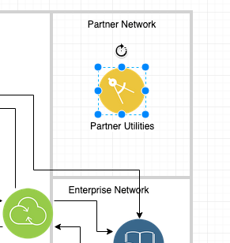

# Accelerating Solution Design with reusable assets and IBM IT Architect Assistant, Community Edition

# (A Self-Paced Tutorial)

This tutorial is intended as a guided tour of using IT Architect Assistant, Community Edition to document a Solution Design. We will use a simple case study to provide a context for the artifact that is created, but one should not spend too much time contemplating the detailed architecture created as the intent is to focus on quickly becoming productive in the use of the tool.

## Overview

### What is IT Architect Assistant, Community Edition?

IT Architect Assistant, Community Edition is a single-user architecture design tool. This single web page application provides the ability to author and customize your own architecture solutions.  Note, that this provides a subset of the functionality of the hosted SaaS offering, IT Architect Assistant.  The architectures authored in the Community Edition are fully interchangable with the hosted environment. For quick pointers see the tool's [User Guide](https://github.com/IBM/itaa-docs/community-edition/Overview-ITAA-CE.md). 

The benefits are improved productivity for a solution architect and improved quality of the solutions created. These benefits result from a consistent, yet efficient approach to documenting solution designs (based on a subset of the IBM System Design Standard), that enhances the ability to quickly and effectively reuse past solutions to construct new client architectures. 

### Overview of this Tutorial / Hands-on Lab

As noted at the beginning, this tutorial is intended as a quick start on becoming productive with IT Architect Assistant, Community Edition. Below we introduce a case study as the basis for your work. Within the tutorial you will focus on the following elements in the tool:

- Architecture Model (or [Table of Contents](#toc)) - what is the overall structure of the architecture asset and which standard architecture artifacts are included.
- Authoring and Customizing an architecture - this is the bulk of the tutorial where you get experience editing content, including manipulating various architecture diagrams.  Note the diagramming tool is built on MxGraph framework, the same foundation of Draw.io.  So if you are familiar with using Draw.io, editing diagrams in IT Architect Assistant will be straight forward.
  - [Copy Architecture](#copy-architecture)
  - [Customize Architecture](#customize)
  - [System Context Diagram](#system-context-diagram)
  - [Reuse Element](#reuse-element)
  - [AOD IT System View](#aod-it-system-view)
  - [Copy icon via edit style](#copy-icon-via-style)
  - [Copy from resource](#copy-from-resource)
  - [Linking reference attributes](#linking-reference-attributes)
- Understanding the lightweight architecture meta-model - this is done in conjunction with authoring to help you understand you are building an architecture model, not a set of independent artifacts.
- Export - how can you generate consumable documents for sharing with those who prefer to review in a more traditional "document-based" form.
  - [Export to Draw.io](#export-diagram-to-drawio)
  - [Export to MS Word](#export-to-ms-word)

## General Set of Best Practices

Do you want to maximize the reusability of architecture content you document? The architecture meta-model embedded in IT Architect Assistant, based on a subset of IBM System Description Standard (SDS), adds significant value to the end-user (consumer) of an architecture asset. But it does require authors to "play along" to ensure you are not bypassing this important foundation. Here are a couple of key points to follow:

1. In diagrams, avoid use of the annotation palette except to add non-architectural visual eye-candy.  All boxes and lines should be an actual architecture element type and thus have meta-data (attributes) that can be populated.  At a minimum fill in both Name and Description attributes for all architecture elements.
2. Reuse common elements across artifacts. This reuse is what provides the traceability across the artifacts.  Direct reuse of an element is available via different mechanisms in each artfiact type, drop-down lists in some text artifacts and "existing element" palettes on diagrams. The tool prevents you from creating two architecture elements of the same type with the same name but it does not know for certain that the user intent for such a "create/add" gesture is to reuse the existing element or is just an error and a new unique name should be specified.  Thus you will be presented with a error that you will  need to resolve before the content can be saved. (Resolution would be to supply a unique name or explicitly "select from existing" and indicate you are reusing the existing element with the same name.)

## *Government Services Case Management*

*A regional government, delivers many services to its citizenry.  Many such services such as direct assistance have many qualifications that must be validated and managed before funds or services can be distributed. Each service has a complex, and heavily human driven, process or set of processes with little transparency to be able to see what complementary services should be offered to an applicant or what pending services might disqualify them for the service being applied for.*

*The government wants to co-create an MVP for a better services management processing platform.  This platform should facilitate a high degree of automation and make it easy to deliver many different end-user channels of engagement - including searching for services; electronic application submission; status on any pending cases; etc.  The suggested MVP will focus on tax subsidies in the form of rebates for utility bills for low income households.*

## Exploring Reusable Assets

IT Architect Assistant, CE delivers **Content authoring** (via a structured asset format and supporting architecture meta-model). As a single-user environment, the only available assets are those that you author and those that you download and import.

There is a rich repository of reference architectures and reference solutions published on [IBM Cloud Architecture Center](https://www.ibm.com/cloud/architecture/architectures). To begin this tutorial we will walk through downloading and configuring a reusable architecture from this site and make it available for reuse in community edition on your local machine.

In your local installation of the Community Edition, you will find the **Workspace** folder. Within this folder there are subfolders, each representing a different architecture available locally within the tool.  To add new architectures from an external source such as the IBM Cloud Architecture Center, you will download an architecture archive file (.zip) and uncompress this archive file into the Workspace folder.

For this tutorial, download the Digital Business Automation reference architecture [archive file](). Then use the  appropriate utility on your system to uncompress this file into your Workspace folder.

After loading the architecture into the workspace folder, refreshing the Browser running community edition, you will see the new architecture card show up on your offline workspace.

In this way you can import a wide variety of architectures that can be reused, customized and/or used to compose with other architectures as you create your unique solutions.

### TOC

##### ___ Architecture Structure (Table of Contents)

After importing the Digital Business Automation Reference asset into your system, open this architecture from the tool's Offline workspace. (A reminder, once you start IBM IT Architect Assistance, Community Edition you access the tool through a Browser and the URL, http://localhost:3300). 

On the offline workspace, hover over the architecture card, **Digial Business Automation Reference** and click Open.  When you open an architecture, you will be presented with a structured asset organized by *artifact types*. The left navigation (top-level) for an architecture is described as the asset Table of Contents (or ToC). Here you will see the available set of artifacts that can be populated.  The name of the artifact type will either be grayed out (currently no content) or bold (indicating available content). 

The [detailed artifact guide](https://github.com/IBM/itaa-docs/blob/master/docs/community-edition/Artifact-Details-ITAA-CE.md) can be reviewed for much greater explanation about each artifact type and what is involved in authoring that kind of content.

### Copy Architecture

##### ___ Seeding a new Solution (Coarse-Grained reuse)

How best to get started on authoring a new solution design?  One can always go to the Offline Workspace and click on the **Add Architecture** button and start with a blank slate. In many cases however it is nice to get started with some kind of pre-existing content. This may be a previous solution you have authored or an imported solution. For each option, finding the closest match to your target architecture, will provide the greatest acceleration.

All architecture cards provide a *copy* menu item in the **...** menu allowing that architecture can then be cloned to seed a new solution architecture. You can trigger creating a copy from two locations. As noted earlier, you can invoke copy from the architecture card view "..." menu. Alternatively, while "in" an architecture you can click on the **copy** toolbar icon.

Either method will take you to a pop-up where you can fill in data describing the new offline architecture to be created from the source asset. The required field is a unique Architecture Name.

For the balance of this tutorial, screen shots and available elements are the result of creating a copy of the **Digital Business Automation Reference** architecture that you imported earlier.  

Note, your architecture (the new copy) needs to have a unique name in the system.  So when making a copy, at least initially use a naming scheme involving your name, initials or client details.   For the tutorial I created a copy named - "**DBA RA - GLC**".

### Customize

##### ___ Customize and Compose

So you now have a new architecture, copied from the reusable asset. The task at hand is to transform that starter set into the target solution design. Given that you are not starting from an empty asset hopefully results in some significant acceleration in creating the target solution design - but it also implies that at some point in the process you will need to review and update all reused content to determine if it applies as is; can apply with some changes; or if in fact it needs to be removed from the asset as it doesn't apply to the target solution.

One strategy is to start with foundational architectural elements as represented via text-based artifacts.  Most notably the requirement elements (Use Cases, Functional Requirements and Non-Functional Requirements) and Architecture Decisions. (You probably also want to make at least preliminary updates to both the Overview and Business Challenge artifacts as those should be very descriptive about what you are wanting the solution to address.)

Next, be sure and review and update the System Context diagram to be sure that the solution scope is properly described. The bulk of the architecture (solution) diagrams can then be addressed.

If you have not already openned the newly created architecture, **open it now**. 

Let's start by looking at the Overview and Business Challenge.  The current asset has an overview, which discusses the general details about *Digital business automation*.  This clearly doesn't describe the solution we are focusing on. You might start by replacing the current text with a variation of the case study statement. Be sure and click **Save** after making changes in the RTF editor box.  (Note if you try and move to another page, if there are unsaved changes to the current page, you will be warned that these unsaved changes will be lost if you move to another page.)

For the Business Challenge, you might add in the KPIs that a new solution might deliver.  Note this field supports the ability to insert images along with most common rich-text formatting. So you are able to make expressive looking sections in your architecture documentation. (More on that later when we look at export options.)

### System Context Diagram

___ **First Diagram**

The asset we copied does not provide a System Context diagram. That is not surprising as the source asset was a reference architecture that is applicable for a wide range of solutions.  Our System Context wants to provide the scope for our particular solution.  Before getting started creating a System Context diagram, you may want to review the details provided in the [user guide for SCD](https://github.com/IBM/itaa-docs/blob/master/docs/community-edition/Artifact-Details-ITAA-CE.md#system-context).  

**Click on System Content** in the TOC! As noted in the user guide, unlike all other diagram artifact types, an architecture currently is restricted to a single System Context diagram instance. So clicking on System Context will immediately take you into the MxGraph-based diagram editor. (For all other diagram/artifact types, you will need to create/open a named diagram instance.)

Note the available drawing palettes.  The primary palette always a diagram specific palette that exposes all of the architecture modeling elements that can appear on the diagram (in this case, **System Context Palette**). No other element types other than what appear on this diagram specific palette are permitted to appear on the diagram.  In addition to the diagram specific palette there is an annotation palette (miscellaneous shapes) that provide drawing elements that do NOT contributed to the underlying architecture model. Finally, there are lists of existing elements already defined in the architecture model that can be reused.

Start by **adding a "Target System"** to the middle of your diagram.  Name it whatever you like, it represents the black box view of your target solution. **Click and "drag"** from the system context palette!

The first thing to notice is the **Attributes** panel that is part of the format panel on the right side. If the current selected item is part of the architeture model, then this tab appears, identifying the type of element and exposing its unique set of attributes. Here, the Target System element has attributes of **Name** and **Description**. The fact that architectural elements are reusable across artifacts within the architecture and have unique attributes is what makes this into an **architecture modeling tool** vs. a drawing tool!  It is important to provide Name and Descriptions to your elements.  It greatly aids in the understanding of your solution design to someone that reviews the asset.

In addition to the Target System, a System Context will define the set of interacting elements "external" to the solution itself to indicate *how* the target system integrates into the larger enterprise. **Add two human actors**: *Citizen* and *Case officer*. Again drag human actor icon from palette onto the drawing canvas.

Next, connect these human actors with the target system. The quick connect user guesture starts by hovering over an edge of an element on the canvas, and waiting for a green "connection" dot to appear. Then click and drag to the other element waiting on a similar green dot before "releasing" mouse button. (see [drawing instructions in user guide](https://github.com/IBM/itaa-docs/blob/master/docs/community-edition/Overview-ITAA-CE.md#quick-connect).)

Let's add a IT System actor, *Utility provider* and connect it to the target system also.

Note before leaving this diagram, review the other **format panel** tabs.  You can change line styles, colors, text font details, and more. So don't contrain yourself to the somewhat blah look to your diagrams.

Then **click save**! 

###Reuse Element

Next click on **Use Case** in the ToC. Then click on **Add Use Case**.

Provide an ID, e.g. **C2G-001** and a Name, e.g., **New Request for Utility Subsidy**.  Note the link to be able to copy a use case from another architecture!  Then click **Create**.

You will be taken to a web form editor to be able to add details to the other attributes of this newly created Use Case. We will take a couple of minutes to populate the actor and the basic flow.

Start by clicking on the **Add a new actor** link. You will be presented with the current available actors within the model.  

These are the 3 actors you created on your System Context diagram. Select **Citizen** and click **Add**.

Next add some text for the flow you think would be involved in a Citizen requesting a new subsidy service into the Basic Flow text area. Then click **Save**.

Click on the **Back** arrow at the top left of the Use Case form. Note you can create Use Cases within a Use Case diagram or using the web form. The detailed attributes are only available via the web form, but you can opt to just work with the graphical form (Use Case Diagram).  Both "views" are fully synchronized.

Feel free to explore and create a Use Case diagram and reuse the existing Actors and Use Case.

### AOD IT System View

___ **AOD and other architecture diagrams**

At this point, although we copied an existing architecture - we have not reused any of the content we copied. So the tasks you have performed could just have easily been done on an initially empty new architecture. So let's focus more on the reuse. To do this we will look at the two artifact types that were populated in the asset we copied: **AOD - IT System View** and an associated **AOD - Usage Scenario**. You should take some time to read through the [description of Architecture Overview](https://github.com/IBM/itaa-docs/blob/master/docs/community-edition/Artifact-Details-ITAA-CE.md#architecture-overview) within IT Architect Assistant's User Guide!

One of the reasons for selecting this asset for reuse was the usage scenario text that follows the solution for Insurance claim processing. There are many elements in this usage scenario that align with the scenario we are trying to solve.

Click on **5.1.4 Usage Scenario in the ToC**. Next click on **Automotive Claims Processing**. When you look at this diagram you will note a set of **step** labels. 

Click on each step starting with **1** and finishing up with **8**.

You will see that each step provides details on a Use Case (or Usage Scenario) and highlights the part of the architecture that is active in supporting that step. This particular scenario has a Business User or our Case office directly involved in the creation of a new case (an auto insurance claim).  That may or may not be the flow you envision for our government scenario, but either way a new case is established. In a similar manner certain supporting documents may need to be added to the case, for instance billing history from each of the citizen's utility providers.  Where will those documents be retrieved from? Will there be need for machine learning models to predict things like fraudulent claims?  Where will the business rules reside to determine eligibility and exceptions?  There might not be any analogy in our scenerio for the repair estimation phase! Dashboards and event collection and display are probably useful in our scenario too.

With that as background, consider the source of this Usage Scenario?   It is an *overlay* to an AOD diagram.  In this case the base diagram is an **IT System view**.  Let's see about manipulating this base diagram and customizing it for our solution design.

Click on the **blue left arrow** (top-left of the Usage Scenario diagram). Feel free to review the other two Usage Scenarios both for inspiration and also knowledge about whether they should be retained in our solution architecture or later deleted.

Click on **5.1.3 IT System View**.  Click on **Reference Architecture**. You will now be editing the IT System View diagram.  This diagram type is quite distinctive as we decided very much to directly support the diagram style used in the IBM Cloud Architecture center.   There are a set of icons available in palettes on the left, but as you will see we will encourage you to reuse content from another reusable asset instead of using icons from the palette. 

First change the name of the diagram.  With no element selected the Attribute panel will show the diagram name and description.   Change Reference Architecture to **Gov Services Case Management Platform**.

Next, change the Actor that currently is named **User/Customer** and change that to **Citizen**.  Update the description too.

Next contemplate the one known external entity which will require Transformation & Connectivity (e.g. API Gateway, etc.) to connect to - namely the **Utilities**.   And what "Location" with they appear in?   Let's consider the following:

A new Location (alongside Enterprise Network), called **Partner Network**.   Add a new Generic Node there called **Partner Utilities**.   We will later reuse an icon for an application component.

Details:

Slide the top edge of Enterprise Network down a couple of inches (just above the current Transformation & Connectivity Node).   Rearrange the 3 nodes within this location and clean up the connections.    

Next, Add a new Location above the Enterprise Network.  Add a Generic Node from main palette and name it Partner Utilities.

#### Copy icon via style

Now let's explore some of the various ways to reuse icons and standard nodes and update the diagram. Start by selecting **Partner Utilities**. In the Style tab of the format panel, click on **Edit Image**. This will open up the file menu/finder and allow you to select any image you want to use as the icon for this element. For now click **Cancel**.   Next, select the Enterprise Applications node and click **Edit Style** in the same Style tab.  Note the **image=...** section of this style.  **Copy** the "File path" that follows.

Next again select **Partner Utilities** node, click **Edit Style**, and replace the image file path by pasting what you copied from the Enterprise Applications node.   You should then see the following:

Next we are going to copy a node icon from another diagram in another asset. Click **Save**.  

When you downloaded and installed IBM IT Architect Assistant, Community Edition it included one architecture asset named, **Icon Library- IBM Cloud Architecture Center**. This asset contains a rich set of diagram templates and building blocks to reuse in your architectures.  To access it from within an architecture (use it as a source to copy from) you will follow the next set of instructions.

#### Copy from resource

Click on **Resource** menu and select **Open from Offline**.  In the list of Select an Architecture, locate the **Icon Library- IBM Cloud Architecture Center** architecture and click **Next**.

Next select **ALL ICONS BY CATEGORY** and click **Open**.  This will take a little bit of time to open as it is a very large diagram with hundreds of icons.  It will open in a new diagram editor tab (read-only).   You may need to scroll the canvas to see the icons.  Locate the **Applications** category.  Find the icon/node named **Customer Care**, select it and "copy it".  Then click on the tab for the diagram you have been editing (to switch to that as the active diagram) and "**paste**" the node.   You may have to zoom out to find where it is placed on the canvas.  Locate the node and move it into the Cloud Network location aligned with the Citizen node (like below).

Study this node you pasted. This is an icon not found in the tool natively. It happens to be a standard node used in both Commerce and Consumer Industry architectures on the IBM Cloud Architecture center and by copying, you get the **icon**, the **standard name** and the **standard description**.   This is a really rich library of nodes you just copied from.   Having demonstrated that, however, we do want to customize the description for our use, namely indicating it is a **citizen government services portal** (maybe we will even change the name).  This will be the application that citizens will interact with to request services and check on the status of service requests. Update the **name and description**!

Expand **Existing Nodes** palette on left and grab **Edge Services** and position as below.  Note Edge Services appears on a different diagram in this copied architecture. (You could have also copied from the Node library and saved a couple of steps.   Doing it this way demonstrates different alternatives available within the tool.)

Explore the attributes of this Edge Services node.  In particular, note the link to an "**Implementation**". Follow the right arrow next to **IBM Cloud Internet Services** to see more information about the physical component either recommended or selected to deliver Edge Services capabilities for this solution.  If you haven't already, click **Save**.  Let's look at other architectural elements that can be linked to solution elements like this Logical Node.

#### linking reference attributes

___ **Linking to NFRs and Architectural Decisions**

Click on the left back arrow to leave the diagram for a moment. 

Select **3.3 Non Functional Requirements** from the TOC. 

Click on **Add Non Functional Requirements**. Enter an ID, e.g. **SEC-001** and a Name, e.g. **Two-Factor Authentication**.  Click **Create**.

Feel free to add additional details to the various attributes of the NFR on the web form editor page. Click **Save** and then **Back** after you make any changes.  Return to the IT System view you have been working on.

Click on the **Edge Services** node and look at the Attributes panel. Note that we can associate Architectural Decisions and NFRs to this node. However, you will see that no decisions are yet defined in this architecture thus the message "**No architectural decisions available**", whereas since you just created and NFR, you get a link to "**Associate NFRs**".

Click on the link **Associate NFRs**. In the pop-up list of available NFRs, click on the checkbox next to **SEC-001**, and click **Apply**. 

While in this attribute section, note the link to **Select from existing** - clicking on this will bring up a list of all of the Logical Nodes available in this solution model. This is useful when you have added a node (in this case) onto the diagram (at least the UI aspect of what you want to show) but you need to make sure the element references a model element used elsewhere. From this list you can select which "model element" the currently selected UI element is linked to. If you clicked into this list to explore, click **Cancel** to dismiss the list.

Before, leaving this diagram to explore other features of IT Architect Assistant, first select a node, and then a Logical Connection, and for each, explore the other format panel tabs (**Style, Text, and Arrange**).  Here you can see all of the ways you can easily manipulate the look and feel of the diagram, including line styles, fill colors, line jumps, text font and colors, text positioning, aligning and spacing of elements and much more. 

#### Export diagram to Draw.io

The underlying diagram is manipulated as an .xml file that is compatible with Draw.io. (MxGraph is the framework used to build Draw.io.)  The .xml file for a diagram in IT Architect Assistant is more complex that the default Draw.io file since it includes all of the architecture model content.  To demonstrate this, click on **File > Export**.  On the resulting pop-up, select **XML** for the format and click **Export**.  Respond to dialog prompts to save file on your local machine. (Note, you can also save this diagram as an image or PDF document from this menu item also.)

Open a new tab in your Browser and enter **https://www.draw.io** in the URL.  Click on **Open Existing Diagram** and navigate to the file **Drawing1.xml** you just saved. What do you see? Is this what you expect?

___ **Other Import and Export Options**

Not everyone you work with have access to IT Architect Assistant or may prefer different formats to consume that asset. There is a rich set of interchange forms available to you in the tool.  For a more complete discussion look at the [Import/Export chapter](https://github.com/IBM/itaa-docs/blob/master/docs/community-edition/Overview-ITAA-CE.md#import-and-export) in the User Guide. For this examination, let's take a look at exporting to **Microsoft Word** document.

Back in IT Architect Assistant, click on the back arrow to exit the IT System view diagram.

Then on the top right side, review the large number of toolbar buttons.

Here you see: Co-relationship, Change log, Export to GitHub, Go Offline / Go Online, Manage orphaned elements, Collaborate, Export / Import, Copy, Comments, and Info.

#### Export to MS Word

Click on the **Export / Import** button. Keep the default **Export** selected and click **Next**. Select **Microsoft Word** and click **Export**.  A request is made to the back-end document generation service to create the corresponding document.  Once the document has been generated you will be prompted to save / open the file. **Save this file** and then **open** the document and review. (Note, for a richly populated solution model, this will produce a large document. You might not choose to use all parts of this document or choose the same formatting, but you have a rich set of content in which to copy and paste from into what ever standard document template you need!)

___ **Explore on your own**

There are many additional artifact types available that this tutorial has not explored: Functional Requirements, Architecture Decisions, Architecture Principles, RAID elements, Logical Data model diagrams, additional AOD types, Component Model view and Operational Model views. 

At a minimum, study the description of a [Usage Scenario](https://github.com/IBM/itaa-docs/blob/master/docs/community-edition/Artifact-Details-ITAA-CE.md#aod-usage-scenario) and start to build a Usage Scenario based on the IT system view diagram you created earlier. If you are successful, delete the Usage Scenarios that you "inherited" when you copied the original architecture.

Follow the [detailed artifact editing guide](https://github.com/IBM/itaa-docs/blob/master/docs/community-edition/Artifact-Details-ITAA-CE.md) and explore other artifact types.  Also consider exporting to PowerPoint and/or Excel.   Note the Excel export has an analogous Import operation that is useful to bulk load model elements into a new architecture.

