# Architecture Visualization Best Practices

An AoT Initiative in 2020-2021 has produced a set of recommendations for [architecture visualization](https://ibm.github.io/itaa-docs/Archi-diagrs-v4.pdf). These visualization standards are being rolled out for a number of different tools, including draw.io, Cognitive Architect, Visio, PowerPoint and others.

In Cognitive Architect which shares the diagramming engine with draw.io, MxGraph framework, the core set of architecture element styles have been added to the corresponding diagram palettes.  This  document presents the current and future user experience of this vizualization "library" within Cognitive Architect and provides some best practice guidance in its use.

If you look at the referenced diagram above, the foundation of the visualization approach is to standardize on such things as:

- Shape = architecture element type
- Fixed color palette (for accessibility) - an typically used to note technology domain
- Shape details (e.g. collapsed, expanded, multiplicity) all managed via limited controls
- ...

Most of what you can and should alter for these "IBM stencil" drawing elements, can be found in a set of "Shape Style properties".   Below you see an IT System View (AOD) in Cognitive Architect with nested - Location, Subsystem and Logical Node being placed on the diagram.  The Logical Node is currently selected and in the format panel, the Style tab is presented and the Shape Style attribute section is highlighted.

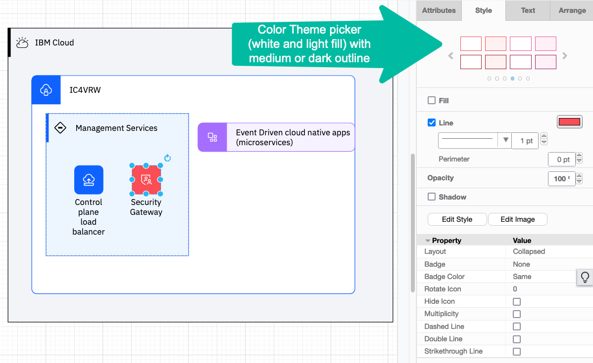

Unlike the document referenced earlier, that presents the draw.io shape properties, Cognitive Architect generally hides the "Shape" property, which is used to select an element type shape style. In Cognitive Architect, the element type was selected from the palette and carries along the architecture model's meta-data properties and so the shape selection is enforced.

The **Layout** property has the two primary options Collapsed and Expanded.  The referenced "Nested" value is just the Expanded style resized. The other entries are used to create Legend entries.

There are specific shape line style values Strikethrough, Double, and Dashed.

**Multiplicity** is an on/off checkbox, which will automatically create the stacked lines to visually signify multiplicity.

Color is controlled via the "Line" color setting and for convenience the new Color Theme "picker". The Color Theme, Fill, and Line color controls appear in the main part of the Style panel!  This control presents the IBM "color palette" and the valid combinations of medium or dark line color and either white or light fill.   Also, note that the color picker that appears for both "line" and "fill" show the IBM color palette colors in the separated two top rows. The top row being "medium-weight" color and second row being "dark-weight". You can also use transparent, white, and black from the top row of the main color blocks. To get the solid color for "collapsed" shapes, the "fill" control should be unchecked.

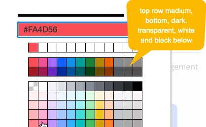

**Hide Icon** is used to remove the icon element for a selected shape. Note there are two diffenent kind of "icons": so called **stencil** icons and **image** icons.  Stencil icons come from a community supported repository, currently, the IBM Design organization (see [UI Icons](https://www.ibm.com/design/language/iconography/ui-icons/library/)). These get specified by having the Icon property set to the value **Yes** and providing the icon "name" in a special data property, Icon-Name. [**Note**: you can click <Ctrl-m> to bring up the data property dialog and edit the properties.] Of  course, remembering icon names, and manually editing the data property is not very user friendly. In a drawing tool like draw.io, this is handled by loading very large "icon palettes" and dragging the corresponding shape+icon onto the canvas. Further in this case, you can change the base shape as this is not tied to any architecture element. 

Cognitive Architect has set out to accomplish a similar approach, but one that is subtly different. First, the tool chooses not to impose a large set of icon palettes on the architecture diagrams, as navigating them becomes difficult. However, a particular user may have a set (or sets) of icons they like to use and apply to different architectural elements. So with release 3.5, Cognitive Architect let's you define custom [icon] palettes, populating them from the "community-wide" superset of stencil icons and/or image icons. These custom palette(s) are then added to the diagram - and presumably much easier to navigate. Important to **note** these palettes are not used to add drawing elements to the canvas, they are instead used to "set/replace" the icon that appears on a drawing element already on the canvas. The gesture is to drag an icon from your custom palette onto an existing drawing element, and the result is replacement of the displayed icon.

What happens when Hide Icon property value is **Yes**? This removes the icon from the corresponding place in the drawing element. This is used when you don't want an icon displayed.

The **Badge** and **Badge Color** properties are used to control the "Badge" referenced in the visualization standard document. A badge is an annotation placed at the top-right corner of the shape.  You can add "text" to this via the "Edit Data" properties panel opened from the context menu or via keyboard short-cut <Ctrl-m>.  Provide text for the Badge-Text property to have it show up.

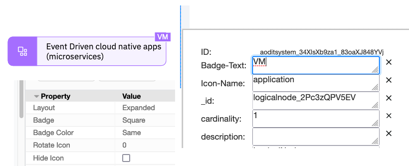

### Custom Icon Palettes

As noted earlier, Cognitive Architect has an evolving approach to make it much easier to manage and manipulate icons on diagram. The approach is to make it easy for users to manage and share icon palettes that deliver easy to apply icons.

Today, on any diagram in the tool, you will find a '+' sign at the top of the drawing palettes.

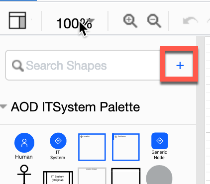

Clicking on this allows a user to create a new custom palette. You will give the palette a **name**, so that you can easily distinguish between multiple custom palettes. A custom palette today is defined at the architecture level and will be available on every single diagram within that architeture. 

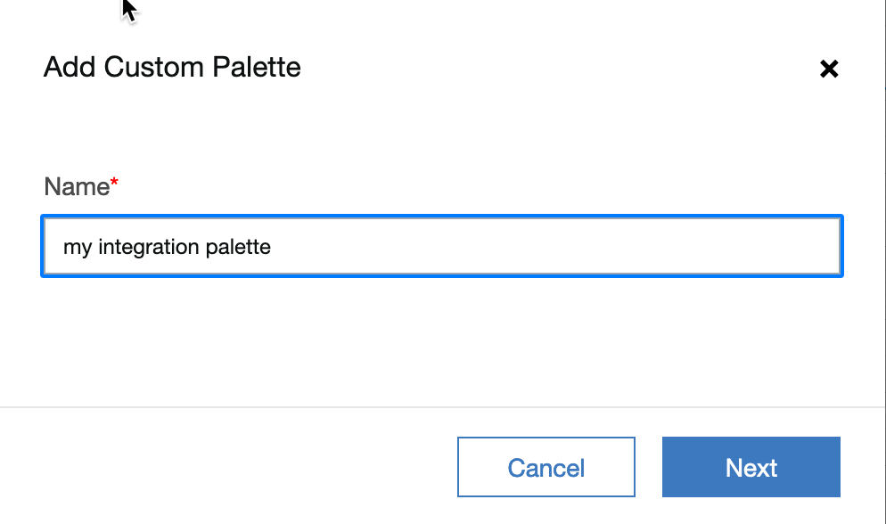

These palettes can also be exported and imported so that you can share them across architectures and across to "teams".

Once an empty custom palette has been created you then want to be able to quickly add icons to the palette. Eventually, these palettes will support managing both "stencil icons" and "image icons". Also eventually you will be able to import from a file to exchange palettes.

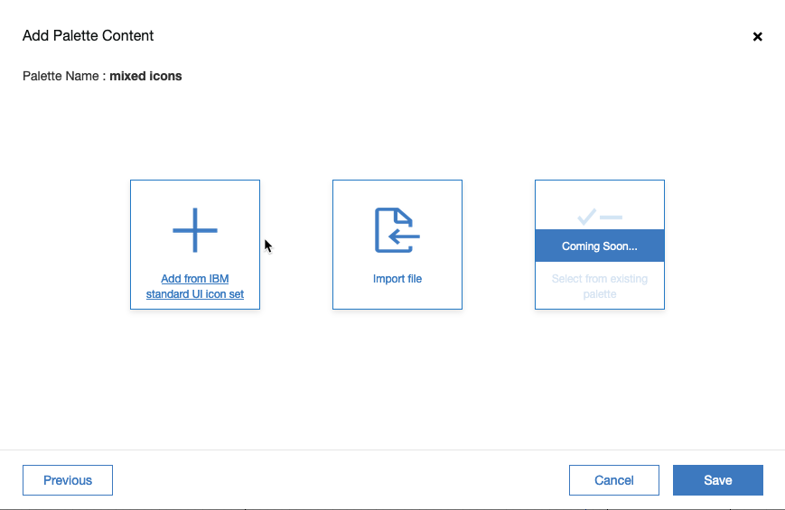

Stencil icons are managed within the tool itself and are sourced from IBM Design UI Icons. Image icons can be any standard image (.jpg, .png, .svg).  This UX supports adding icons to your palette from the large list of built-in icons. [Note, the built-in icon set will grow significantly and soon will have the icons grouped into categories.]

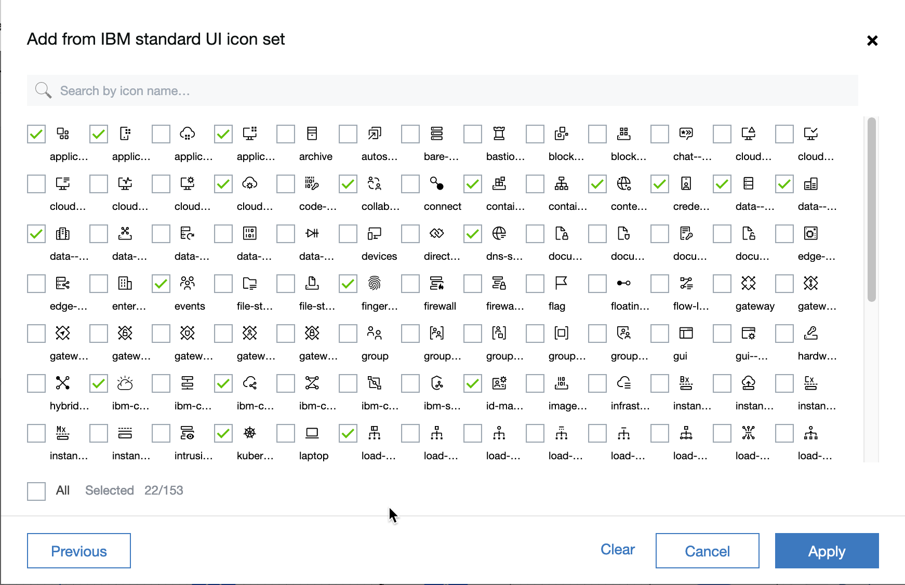

Select from the list and click Add, then review before saving. Note, that on this review page, there is a toolbar icon in the upper right corner to allow you to select (image) files from your local machine. This is how you then add "image icons" to this palette. This control is also available later from the "edit palette" control.

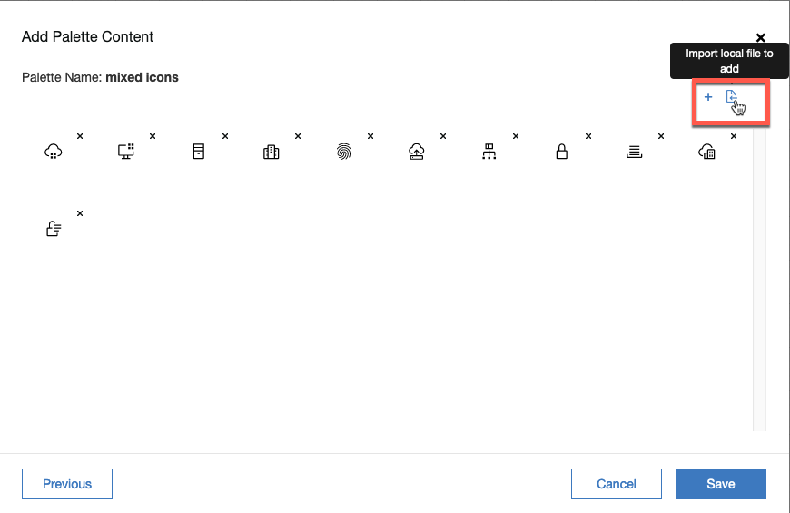

For example, here is the edit palette control after adding 3 images from file system. Note, when you add an image, it is unnamed. You can (optional) provide names for the icons to make them easier to recongnize and use.

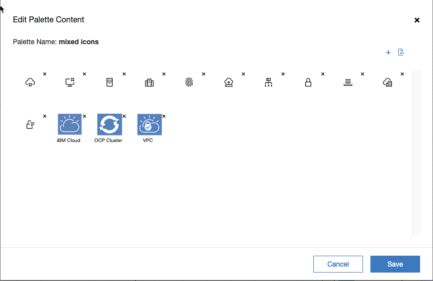

The newly created palette will show up as a new diagram palette.   

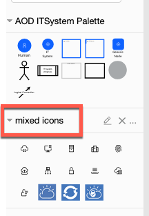

Note these custom palettes can not be used to add drawing elements to a diagram, they are only used to alter the applied icon to existing elements on the canvas.

To use, drag an icon onto an element.

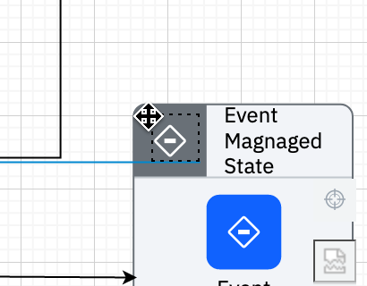

The result will be to apply that icon to the element.

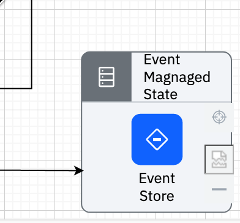

### Behavior differences image vs. stencil icons

Stencil icons can only be applied to the new, IBM architecture visualization standard elements on the canvas. Image icons can be applied to either the new IBM architecture visualization standard elements (note they will be scaled to be quite small) or to the "original" styled elements. For the original styled elements, the drag-and-drop has the same impact as if you clicked on "Edit Image" and loaded the corresponding image file from your local disk.  

### Managing Custom Palettes

Currently, the custom palettes can be defined within an architect and can be exported and imported as an xml file. This way you can create sets of palettes that you want to consistently use and possibly share with your peers. To export, click on the '...' menu for a custom palette and click Export and then save to disk. The import operation is available both on the create new palette dialog (see earlier image and the Import File option) and from the edit palette dialog by importing a palette .xml file instead of a image file.

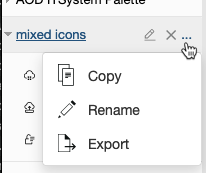