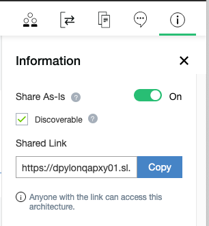
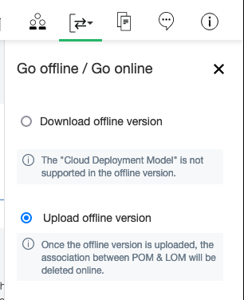

# IBM IT Architect Assistant User Guide
**IBM IT Architect Assistant** (Architect Assistant) is a simple web-based tool to assist an Architect in designing a solution by finding the best/relevant/potential architectural solutions and/or patterns and customizing them for specific needs.

At its core, **Architect Assistant** is both a solution model authoring tool as well as a searchable repository of authored solution architectures/models.

The Documentation is organized in the following sections:
- [Terminology](#terminology)  
- [Getting Started](#getting-started) 
- [Major sections: Workspace and Search](#workspace-search-and-dashboard)
- [Search](#search) 
- [Architecture Cards](#architecture-card-elements)  
- [Workspace Details](#workspace---private-collaboration-and-bookmarks)
- [Basic authoring of architecture artifacts](#authoring)
- [Reuse, Copy and Paste](#copy-and-paste)
- [Import and Export](#import-and-export)
- [Collaboration](#collaboration)
- [Detailed authoring - by artifact type](./Artifact-Details-ITAA) 

## Terminology
Before diving into details about Architect Assistant it is important to understand some key terminology used throughout the documentation.  

**Logical Asset Repositories** -- Today there are 3 logical repositories of architectures: **Public**, this contains curated, read-only architectures that can be discovered via search; **Private**, every user has a set of private assets that they own, that by default are read-write and not discoverable by other users; [**As-Is**,](#as-is) any private asset can be set as discoverable (marked As-Is and discoverable) by the owner. As-Is assets are optionally searchable and anyone following the [shared] link to an As-Is asset will be added as a "Viewer" collaborator.  

**(Note:** if the architecture you create contains confidential information or personal private information, only share the architecture by explicitly adding collaborators (do not share "As-Is").  Further, make sure any collaborators are aware of the sensitive nature of the architecture content and do not expose to others.) 

**Collaboration Roles** -- All architectures have an **owner**. For private (and thus also As-Is) architectures there can be a set of collaborators. A collaborator is a user that has a set of permissions for the architecture. The roles are:  
- **Viewer** -- has read-only access to the architecture  

- **Editor** -- can make changes to any content of the architecture  

- **Admin** -- is an editor that can also change the role of any collaborator.  

- **Owner** -- is the only user that can delete the architecture.  
  An owner can explicitly "invite" collaborators and assign corresponding role to each. There also is the ability to create and manage groups of users for purpose of collaboration. (Note for all **Public** assets, all users are implicitly **Viewers** and no one is an Editor or Admin).  

  (Security consideration： All the collaborators have the privilege to export and upload the architecture and/or copy it.  When you add collaborators to an architecture, make sure the collaborators are aware of any confidential content and protect it following the policy required by your community. Ensure that architecture assets do not expose sensitive information and are only viewed or accessed for their intended business required.)

**Artifact** -- An architecture (asset) is comprised of a set of artifacts that are typed. The standard set of artifacts are displayed in the architecture's Table of Contents (**TOC**). Many of the artifact types can have 0 to n **artifact instances**.  Examples of artifacts include Business Challenge, System Context, Functional Requirement, etc.  Most of the artifacts correspond to a technical work product.

**Shared Elements** -- The building blocks of an architecture are a set of **architectural elements**. Each of these elements have a **specific type** along with a **set of attributes** (or meta-data). Many of the architecture elements contribute to and are referenced within multiple artifacts and artifact instances. As such it is important that these elements are shared (i.e., by reference). The implication is that each shared element must have a *unique name* within the architecture. To enforce this constraint the tool will *flag as an error* anytime a new element is created and given a name already in use in the architecture.  This error forces the user to either bind to (reference) the currently existing shared element or if the user needs to reference a different architecture element, supply the new element with a unique name. For example, adding a new Logical Node to an AOD IT System View instance and giving it the name **Customer Service** when a Logical Node with that name already exists (perhaps on a different diagram instance) results in an error (duplicate name error). 

###### **Bind to existing element**

To resolve this the user can select the Logical Node in error and click on the **Select from existing** button (at the bottom of the Attributes tab of the Format panel) and point to the existing Logical Node, indicating you are reusing the same element. 

Alternatively a different (unique) name can be assigned. Either approach will remove the error.

------

Additional "big picture" tips about the tool can be reviewed in the [Common Tips](../CATips) document.

 

##### Visualization Notation

With release 3.3 of the tool, most of the diagram specific element palettes have been updated to reflect the emerging IBM Architecture visualization notation. This IBM Design supported notation specifies graphical element shapes and properties that can be consistently recognized to represent specific architecture elements types, e.g Logical or Prescribed Nodes, Logical or Prescribed Components, Target System, Actors and then various Groups e.g. Locations, Zones, VPC, etc. 

At the time of this release, the diagram specific palettes will contain the new standards as well as the previous (deprecated) notation. The reason for preserving the deprecated notation is to support ongoing editing of diagrams built with the previous default notation.

It should be noted that the code for this standard notation is shared with IBM released palettes for the Draw.io tool.  The full IBM [draw.io] architecture palettes can be found in the Misc Diagram palette.

A document explaining the notation standard is [available for review](../Archi-diagrs-v4.pdf). For more detail on the modeling element definitions, see [type glossary](./Artifact-Details-ITAA#glossary---shared-core-architectural-elements).

([Back to Top and TOC](#ibm-it-architect-assistant-user-guide-v11))

## Getting Started

### Help

Anywhere within IT Architect Assistant you can navigate to the appropriate section of this User Guide via the keyboard short-cut (**F1** or **fn-F1**)!

### Security Considerations

-  Use IBM IT Architect Assistant in a secure network environment
- Keep your username and password safe.
- Logout when you are not using it.

###Usage Intent

Getting started with Architect Assistant depends on your usage intent. The most common usage intents are:  

- Search for and review an existing and accessible architecture. This scenario may be to support an architect understanding about what assets are available and/or specific details about any particular architecture.  
- Author a new or existing architecture.  

In each case the fundamental construct is an architecture. An architecture is comprised of a set of interrelated artifacts many of which share a set of elemental architecture building blocks (or elements). The best way to visualize this structure is through Architect Assistant's Table of Contents for any architecture.

The ToC, shown above, is the default for architectures created in the tool. This standard structure directly supports the details of a specific solution architecture, but can also be used to manage a set architecture building blocks which are described as a **architecture pattern** within the tool.  This may be a library of reusable standard *parts* or a more integrated set of reusable content.  These *architecture patterns* typical get used as a source resource for copying a subset of the pattern asset into a target architecture.  This is useful to be able to consistently use these building blocks in multiple architecture.

IT Architect Assistant does support multiple ToC templates.  A template defines the available artifact types along with the display name and order in which they will appear within the ToC for an architecture with that template applied.  This feature of "custom" ToC templates supports assets that have a different focus (e.g. TOGAF, etc) and/or teams or clients that use different terminology for artifact types or prefer to focus on only a subset of the standard artifact types during architecture documentation.

Note that an architecture is what is addressable via search, can be edited, copied or deleted. In Architect Assistant, an architecture can be selected via a **card** that will appear in either your workspace or in the search area. 

## Workspace, Search, and [Dashboard]
When a user logs into Architect Assistant they are presented with two (2) or potentially three (3) tabs.  

The two primary tabs (sections) of the tool are **Workspace** and **Search**. **Search** is used to discover existing assets found in the Public and As-Is repositories. **Workspace** is where a user has access to a specific set of architectures. If a user is the owner of 1 or more architectures that are discoverable via search, then the **Dashboard** tab will be available.  The Dashboard provides information about who has made copies of the user's "published" architectures. 

([Back to Top and TOC](#ibm-it-architect-assistant-user-guide))

### Search
When a user navigates to the Search page, they are presented with the **top trending public assets** along with a search bar.  

The default search is made against a set of keywords and tags as well as the text of the Title of the architecture.  Each architecture can have a set of tags associated with them. These include the applicable **Industry(ies), Technology(ies), and Tags** which are part of the architecture meta-data.  (The architecture level meta-data is editable by clicking on the "Information" toolbar icon within the architecture itself.)

In the above image, it can be seen that the tags are displayed on the architecture **card**. The architectures returned in a search result set are either **public, readonly (curated)** assets or are **private, As-Is** assets. 

### As-Is
Any user of the system can choose to have a private architecture that they own, discoverable via search. This property is enabled/disabled via the architecture information page.  The information page is accessible via the info toolbar button of an open architecture. This architecture information page is where an asset owner can change the architecture name and other attributes such as client, opportunity number, tags, etc.

If you are the architecture's owner and you currently have edit control on the architecture, the **Share As-Is** slider control is enabled to turn **On** or **Off**.  When on, there is a "shareable" URL available for copy.

This shareable link has a special format. The URL will be of the form <IT Architect Assistant server>/architectures/**Social**/...  When a URL of this form is used to access the identified architecture, two actions occur prior to redirecting to a URL where **Social** is replaced by **Collaboration**.  First a check is made to see if the target architecture still has "As-Is" property enabled. If not, the URL is rejected. If the architecture does have "As-Is" property enabled, a check is made to see if the logged in user is currently a "collaborator" for the target architecture and if not, they are added as a *Viewer* on the architecture's collaboration team. Then the URL is rewritten and forwarded, resulting in opening the architecture from the user's Collaboration Workspace tab. 

A second part of this Sharing (supporting search), is the checkbox to set the architecture as **Discoverable**. By default when you turn on "Share As-Is", the Discoverable checkbox is selected.  When Discoverable is checked the architecture is included as an asset that is discoverable by the tool's Search engine. Note, with this secondary selector, it is possible to get a sharable URL to your architecture, without having your asset show up in Search results.  This would be accomplished by having Share As-Is turned on and uncheck (disable) the Discoverable setting.

####Copy Architecture

Any architecture returned via search will have a minimum of "Viewer" access for all users. Thus the architecture card's additional menu will include **Copy**.  This permits the user to create a complete copy of the architecture by supplying a new unique name for the resulting Copy.

This is a fundamental operation to support rapid reuse of an asset. Once you have created a personal copy it can then be tailored to meet your needs. Many of the public, curated architectures are Reference Architectures or Reference Solutions, ideal for tailoring and generating a specific solution architecture. 

### Search Filters

The result of a search produces a set of cards for the architectures matching the search keywords. There are a set of filters available to select a subset of the returned search result. These include filtering between showing curated vs. As-Is architectures. It also includes selection of asset type (Solution Architecture, Reference Architecture or Architecture Pattern).

([Back to Top and TOC](#ibm-it-architect-assistant-user-guide))

### Architecture Card Elements

In all contexts an Architecture card has many of the same elements displayed. The architecture name is prominent on the top left with an "additional menu" identified via the ellipses **...** in the upper right corner. The color of the top half of the card along with the text and icon at the bottom of the colored section identify the type of asset. In the bottom half of the card (when you are not hovering over it), you will see a set of optional tags. And at the bottom you may see 0-2 *metrics* displayed, depending on context and whether or not the architecture is As-Is or a public curated architecture.

In the card above, you see a public *reference architecture*. As such there are two displayed metrics. The first, *copied* will be associated with both public assets and As-Is assets. It shows the number of unique copies that have been made by users. The second metric, *Rank*, is unique to public assets. Rank is computed daily and rank orders all public assets based on the number of copied made during the past 30 days. So in the example, 9/19 indicates this architecture had the 9th most number of copies made in the past 30 days when comparing all 19 public assets. Non-searchable architectures will not have any metrics computed or displayed on the corresponding architecture card.

When you hover over an architecture card, the display changes.

The display will provide the architecture name and then two buttons, **Open** and **Quick View**. Clicking on **Quick View** opens up a summary panel on the right side of the browser. This quick view will include Type, Name, Tags, the Overview text and a list of the populated Artifacts.  If this is a private asset, the information about the owner will also be displayed.  The bottom of this Quick View is the **View Detail** button which performs the same operation as the **Open** button on the main card.

Clicking on **Open** will then open the architecture, displaying the Table of Contents (TOC) on the left side and the details of the selected artifact (selected in the TOC) in the main section. By default, the asset opens to the **Overview** artifact. When you open an architecture, you may open it in View mode (readonly) or in Edit mode. Opening in Edit mode at a minimum requires being an Editor or Owner of the corresponding Architecture.

### Typical Use Case from Search

In general, if you choose to open an architecture discovered via search you will open in **View mode**. And most will use this detail viewing as an opportunity to decide how they wish to use the asset. When an architecture is open on the primary TOC view (i.e., not within an artifact instance), there are a set of toolbar buttons available on the upper right part of the display, immediately under the Workspace and Search tabs. Two of these are more commonly used while reviewing a discovered architecture. 

First, the bookmark button which is only available for **public curated** assets, allows you to add a link to this architecture to your bookmarks to either locate it more quickly later or to reference the asset for fine-grained copy and paste. Second is the copy button that allows you to create your own **private read-write** copy of the complete architecture. If you choose to create a private copy, you will supply a unique architecture name and optionally provide client name, opportunity number and meta-data.  Once the copy has been created you will be taken to your Private Workspace view where you can then open this newly created copy.

([Back to Top and TOC](#ibm-it-architect-assistant-user-guide))

### Workspace - Private, Collaboration, and Bookmarks

The Workspace is an area in which a set of Architectures, referenced by the user, can be located. The default workspace tab, your **Private Workspace**, maintains all architectures owned by you. These are read-write assets that will typically be associated with specific solution designs that you are working on. The default sort order is by name, you can temporarily select to sort by most recently modified. You can also filter the list of architectures visible by selecting 0 or more Client Names and 0 or more Tags. This makes it very easy to locate specific architectures within your workspace.

The second workspace tab is labeled **Collaboration**. Here you will find all architectures that have been shared with you. These are architectures owned by someone else and they have either explicitly shared access with you by adding you as a collaborator or they have chosen to share the architecture anonymously by marking it **As-Is**. Once you follow a link to open an As-Is architecture you are immediately added as a Viewer on that architecture. 

How you work with architectures in the Collaboration tab is dependent on the nature of the sharing. An owner may share access to an architecture to either provide you with awareness or to elicit feedback (review and/or comments). There is an explicit capability whereby you can leave comments on any architecture you have access to.  The comments are associated with an artifact type and are tagged with your email address (as comment author) along with a timestamp of when the comment was made. 

You might be given **Editor** rights to an architecture whereby you can become a co-author on the architecture, sharing a single **pen** indicating who has edit control at any point in time. Lastly, by having access (of any kind) to an architecture, provides you with the ability to create a private copy which you can then independently customize for your own purposes.

The third workspace tab is labeled **Bookmarks** and provide links to discoverable architectures that you have chosen to bookmark.  These are particularly useful to reference an asset which you will use to copy from. Generally you will be copying a small portion of the architecture, e.g. as an interaction pattern from one of its diagrams.

Back on the private workspace where you find the set of architectures you own, there are a set of options available to you on the "more" **...** menu. Always available on all architectures everywhere is **Copy**.  This requests a new copy of the architecture to be created, owned by the invoker. Scenarios for copying include implicit versioning or starting a new project with an initial starting point. In addition, as an owner of an asset you will have the ability to select **Delete** off of the same menu. Finally, in the current release, if you are and editor or owner of an asset and there are at least 2 editors, then this menu will have an item to control access to edit privileges. The menu will either contain **Get pen and lock** or if you already are the designated editor (holder of the pen) the menu item will be **Return pen** whereby you can relinquish editing control. 

([Back to Top and TOC](#ibm-it-architect-assistant-user-guide))

## Authoring

If you have edit control, when you open the architecture you will be able to author any of the contained artifacts.  Earlier we showed the standard TOC for an architecture. Let's classify the individual artifacts to help setup common user experience for authoring. First, there are artifacts that have exactly one instance and thus edit them directly and another set of artifacts in which you will edit individual artifact instances. The Overview, Business Challenge, and System Context each only have a single instance. So when selecting these artifacts in the TOC, the directly editable content appear on the right side with the ability to **save** your changes. Both the Overview and Business Challenge are rich text based artifacts, so the "editor" is a lightweight rich text enabled text box. The System Context is a diagram and thus the editor is the tool's MxGraph-based diagram editor. All other artifacts support multiple instances, so selecting such an artifact (for example Functional Requirements) will lead to the right side being a list (card style) of the currently existing instances plus a card-like control (**Plus sign**) that you can click on to create a new instance.

Clicking on the Add instance button will prompt for the minimal set of properties to uniquely define the instance (usually just name, but sometimes also an id). From a basic user experience perspective, there are four types of artifacts and therefore artifact instance types: 1) Form-based text artifacts, 2) Free form text artifacts, 3) Diagram artifacts, and 4) a diagram overlay artifact. 

### Form-based text artifact types
The first type includes: Use Cases, Functional Requirements, Non-Functional Requirements, Architecture Decisions, Architecture Principles, Risk, Assumptions, Issues, and Dependencies.  These typically would be viewed outside the tool as tables each with a very specific structure (attributes) based on the information represented by the artifact type where each row (or record) corresponds to a single artifact instance. Since the editor is form-based, you will have individual fields (attributes) editable by their own UI control.  In some cases, an attribute value may be a reference to an architectural element, typically presented via a drop-down list.

### Free form text artifacts
The second type of artifact from a UI perspective includes **Notes**. Notes are intended to easily allow any miscellaneous content to be attached or associated with an architecture that otherwise doesn't have a structured artifact prescribed. Each Note is a standalone entity which includes Rich Text (including embedded images) along with file attachments. Here the editor is a specialized rich text editor. There is an option to create (manage) a set of labels or tags that can then be added to Notes. The visible Note instances can then be filtered based on the applied labels.

### Diagrams
The third type of artifact provides the richest user experience. These are specialized diagram types all of which are delivered by a custom *MxGraph-based* diagram editor. MxGraph is an open source framework that delivers client side JavaScript diagramming capabilities.

Above is a System Context diagram in Architect Assistant. Let's look at the various parts of the editor. 

The top two rows include the menu and toolbar controls.  These are only present when the diagram is open in edit mode. If you are just viewing a diagram, these elements won't appear on screen (including the explicit save button). 

Next on the left hand side you will find a set of drawing palettes. These supply the elements that can be added to the drawing canvas (the main part of the editor and where the diagram resides). In IT Architect Assistant, the top most palette will have a name that specifies the type of diagram, and includes all of the *architectural elements* that can be added to the diagram [**Note**, the [Misc Diagrams](#misc-diagrams) are an exception to this pattern as they are intended as a sketch tool without specificing architectural elements].  In this case the **System Context Palette** includes a Human Actor symbol, an IT System Actor symbol, a Target System symbol and a Connector symbol. Each of these symbols, when added to the diagram, will be associated with an architecture element (core model element) each of which have an associated set of attributes dependent on the element type. 

The attributes for a model element appear within the **Attribute** tab of the **format panel** typically visible to the right of the diagram (canvas).  For example, in the diagram above you see the green Target System symbol, named Target System, selected. Since the selected item represents an architectural element, there is an Attributes tab on the format panel that displays the attributes of the associated architectural element. In this case the type of architectural element is a **Target System** with **Name**, *Target System* and **Description**, "System to support ...". The Attribute panel is where you actively edit the underlying architecture meta-data within the diagram editor. Depending on the architecture element type of the drawing element selected on the canvas the attribute panel can display a large set of element attributes.

In addition to the diagram specific palette, there will always be an *Annotation* palette.  This palette contains a set of common shapes. Adding a symbol from the annotation palette onto the diagram just adds that shape to the diagram. This shape is NOT associated with any architectural element.  Thus annotations are just used to add style to the diagram.

Below is the same System Context diagram (using older deprecated drawing elements), with the pink cloud shape selected. Note that the format panel only shows the Style, Text and Arrange tabs; the Attributes tab is missing.

#### Existing element palettes

Also available are a set of palettes that represent the reusable architecture elements available in the architecture that are appropriate for this artifact type.   In the example above you see **Existing Human** (actor) and **Existing IT System** (actor) palettes. Here you can easily drag an element that has been defined elsewhere in the architecture onto the diagram (for reuse).  

With the exception (currently) of Existing Nodes in AOD IT System View, dragging an existing element onto a diagram will use the default icon for the element type.  As of release 2.9, Logical Nodes in IT System views, will be associated with the icon you are using within your diagrams (and are visible as such on the Existing Nodes palette).

In general you add something from a palette onto the drawing canvas via a drag operation. Select a symbol and drag from the palette to where you want to place it on the canvas. If you just click on a symbol, the symbol will get added at a random location on the canvas. 

#### Custom [icon] palettes

A user can also create and use a set of custom palettes which are designed to enhance the manipulation of a drawing element's visual icon. These custom palettes behave differently than all other palettes in that they do not add a new element onto the canvas but instead are used to modify the icon displayed on an existing drawing element. (See [document summarizing the visualization style management](./ArchVisualization) for more details.)

#### Drawing Connections

All non-line/connector symbols have a "bounding box" which includes anchor points where connections can be made by the endpoint of a line/connector symbol. When connecting the end of a connector to a symbol you will want to see a "green" connection dot or green bounding box outline appear before releasing the mouse to make the connection. Otherwise, you will have just moved the line's endpoint without accomplishing making a connection.

The start state for the above graphic is a connector (highlighted in red along with error message) whose one endpoint is not connected. The arrow head end has been grabbed using the mouse and the mouse moves over the edge of the target system. When positioned properly, you see the anchor points (the tiny blue 'x's), and the "hot green dot" shows a selected anchor is active. Releasing the mouse will make the connection (as per earlier version of the diagram) and the error will be removed.

#### Quick Connect
In the case of the System Context diagram (and many more of the diagram types), there is exactly one type of connector supported on the diagram. In these cases it is not necessary to explicitly drag the connector from the palette onto the canvas and then connect each end. Instead, with nothing selected on the diagram, hover the mouse over the bounding box for a symbol you which to have as the starting point for a connector. Once you get the green outline or green circle, click the mouse and then move over the boundary of the destination symbol. Once you get the destination symbol (outline or circle) to turn green, release the mouse.  This will add the connector while connecting it at the same time. 

#### Style and more
The MxGraph framework provides a rich set of formatting tools to help you make the diagram look however you would like. Many of these are self explanatory and are available directly in the 3 separate tabs of the **format panel**: Style, Text, and Arrange.  

The Style panel let's you apply style to whatever element is selected.  So if it is a line, the choice of line style (dash, solid), endpoint style (arrow type), thickness, color, etc.  You can also adjust whether the line is straight, curved, orthogonal jogs, etc.  Also if two lines are selected (which cross), you can set the style for the line crossing.  If the symbol is a shape then things like fill and outline color, etc are available to be changed. 

The style panel also includes an Edit Style button which provides access to the basic properties of the shape for instance the base shape type, whether it is a container, whether the shape is represented by an image (icon) - thus exposing an "edit image" control, etc. Knowledge of the "Edit Style" and the corresponding style commands are most important to be able to replace the style of one symbol with the basic style of some other symbol in the system. 

------

Today there are two major element styles within each architecture diagram specific palette. The first set conform to a new emerging [IBM architecture visualization standard](../ArchVisualization.md). The second (labeled 'original') are the original styled elements from the origin of the tool. Manipulation of each of these, particularly from a graphic icon perspective, are evolving within the tool. These new styled elements are manipulated through a set of Style properties that override many of the built-in, MxGraph, style controls.

------

##### Style Properties

**Tip:** For instance, you might want to have your Target System represented by an image in the System Context diagram. One way to do this is copy the style from a Logical Node from an AOD IT System View and paste that into the Style for the Target System and then edit its image. This approach of identifying and applying a style from a symbol from any diagram to a different symbol in the same or different diagram type can universally be applied. 

The Text panel let's you modify the text properties for the selected item.  This includes things like positional alignment (vertical and horizontal), font family and size, bold, italics, and underline, word wrap, font color and background color.

The Arrange panel allows you to position the layering of stacked items (to front, to back), the size of symbols and the position relative to the canvas, and flip and rotate symbols. Of perhaps most value is being able to select multiple symbols and align and space them.

**Tip: Grouping** There are two separate approaches to "grouping" elements in diagrams: 1) containment (parent / child) and 2) Group.  You can define any symbol as being a container and optionally collapsible, for example Subsystem, Location, OMLocation.  This is done within the Style panel by clicking on **Edit Style** and  adding properties, "container=1;" and "collapsible=1;". Any symbol with container=1 will be highlighted when another symbol gets placed within it.  Then moving the parent (container) will move it along with all its contained children as a group.  You can also select multiple independent symbols, and then on the Arrange panel, click on **Group/Ungroup** to make them act like most drawing tool symbol groups.

#### Undo, Save, and Auto-save

Architect Assistant is a single page application (written in Angular). In this environment all of your edit operations are being handled within the Browser via the MxGraph javascript library. As you make changes, MxGraph is managing a "stack" of changes you make allowing you to "undo".  At the same time, nothing is being persisted to the back-end until a "Save" is performed.   Thus, if you were to make several changes and then close your Browser your work will be lost. The Save button, in the upper right corner of the MxGraph editor, will write-back the current state of the diagram (and underlying architecture model) to the back-end for saving. 

When a diagram is saved, the undo "stack" is cleared. Thus, undo is only available between "saves". 

In addition to the explicit save, Architect Assistant will "**auto-save**" your diagram every 5 minutes.

#### Model validation rules and Auto-save
Each diagram type has a set of validation rules associated with it to help maintain a valid architecture data model.  For example, a System Context diagram, must have 1 and exactly 1 Target System present on the diagram. In addition, all connectors must have 1 endpoint connected to the Target System and the other endpoint connected to an Actor. In other words, connectors are not allowed to connect two Actors together. Also while editing this diagram, there are some architecture-wide validation that is also being enforced, e.g., each of the Actors and Target system must be unique (unique name) within the Architecture.  Attempting to name a symbol/element with a name that already exists will generate an error. In the case of the System Context diagram, all of this validation can (and is) performed by the front-end logic, i.e., the UI. In other diagram types, there are some validation rules that can only be fully assessed by the back-end during a "save" operation. The user experience of these types of validation checks, is that you won't see the validation error message until the save happens. This is particularly odd for the user when the application "auto-saves". In this case you might not be actively doing anything in the editor, auto-save occurs, and the back-end detects a validation error and you likely get a "save failed" along with the validation error.

**Tip**: When starting to work on a new diagram type, you are advised to explicitly save after any noteworthy change to the diagram so that you can better understand any back-end validation errors that may get triggered.

#### Diagram level attributes
In any diagram in Architect Assistant, with no symbol selected, the Attributes panel will present the attributes of the diagram itself.  This is where you will see the diagram name, a diagram description (which is where you can document the intent of the diagram), and potentially one or more diagram level view controls.  One common view control is turning on/off displaying of connection names on the diagram.

### Diagram Overlay artifacts
The fourth artifact type from a user experience basis is a diagram overlay, **Usage Scenario**. The usage scenario provides a way to overlay a "story" or "flow" onto an existing Architecture Overview diagram. What is uniquely authored in a Usage Scenario instance, is this story. When a new instances is created, you must first specify the AOD diagram it is based upon (selected from a list) along with the scenario name.

In the editor for a usage scenario, there are no drawing palettes. Instead you are provided with a way to select a "connector" or "element" from the underlying AOD diagram and then associate it with one or more *steps*. A step has two attributes, **name** and **description**. The name must be a single token limited to 3 characters max from the set of "letters", "numbers", and ".".  The description is used to tell the "story segment" associated with the step. When an architecture element is selected on the diagram, all currently defined steps for the usage scenario are presented along with a checkbox to select or deselect each one. The usage scenario editor will place "step circles" on the selected connector or on the edge of a "node-type" element for each associated step. When given the option to select the associated steps, you are also presented with the ability to create a new step.

In addition to adding and associating steps to connectors, you can also select any non-connector symbols and "disable" them.  The editor then will "gray-out" these disabled symbols.

#### Misc Diagrams

As briefly noted earlier, the Misc Diagrams have a different purpose. Misc Diagrams are based on the same MxGraph framework as the other diagram types but are delivered without coupling to a specific architecture [diagram type] meta-model. Here all drawing elements are *annontations* (no attached meta-data). You do have a richer set of drawing palettes to support creation of org charts, business process flows, C4 diagrams, etc.   Thus you can use IT Architect Assistant to create diagrams not supported as first class citizens by the underlying architecture meta-model.  As will be described shortly, you can also start with this diagram style (as a **sketch**) and later, if appropriate, convert the diagram into a supported architecture diagram. The other feature supported in Misc Diagrams is importing an existing Draw.io authored diagram. This import is provided via the *File > import draw.io diagram* menu item.

#### Render Typed Diagram and Convert Elements

Closely related to the introduction of the Misc Diagram is the ability to apply architecture meta-model attributes to an object that doesn't currently exhibit any such attributes. The first part of this is to be able to create an architecture diagram from an existing Misc Diagram. Each artifact type that is represented by a diagram now has the option on the "Add diagram" dialog, to *Render from miscellaneous diagram*.

Clicking on this link will provide you with the list of current Misc Diagrams available in the architecture. Completing the "render" operation will add just the meta-data for the diagram itself appropriate for the type of diagram being added.

This is generally only valuable if you can also then **convert** the associated drawing elements (annotations) into architectural elements, thus adding or associating the corresponding element type meta-data. To convert a drawing element, select it, then right-mouse click to bring up the context menu, and then select Convert > *type of architecture element to covert to* from the menu. (Note you will only be presented with the element types supported by the drawing element kind: line or shape AND the corresponding diagram type.) Via repeated application of element conversion, you can take any sketch or imported diagram and manually convert these to full-fledged architecture diagrams while retaining the original look and feel.

([Back to Top and TOC](#ibm-it-architect-assistant-user-guide))

## Breadcrumbs and Navigation

Navigation within the tool is managed in several ways. From a top-level landing pages you have the two-level navigation tabs presented as seen here.

Within an architecture there are two different navigation mechanisms. When you are not within an artifact instance, the TOC provides the way to select an artifact type to view or edit. In or out of an artifact instance, there is a "breadcrumb" that supports navigation to all levels of the tool. If a particular level of a breadcrumb represents multiple options at that level, there is a "down arrow" that will present you with the available elements at that level to select and navigate to.

([Back to Top and TOC](#ibm-it-architect-assistant-user-guide))

### Copy and Paste

With any documentation tool you want to be able to quickly reuse elements. This is logically a copy and paste operation. In some of our how-to videos, we describe both fine-grained and coarse-grained reuse support within Architect Assistant.  

### Coarse-Grained Reuse

The **copy** operation at an architecture level (either via the '...' menu on the asset card or via the *copy* toolbar button within any architecture) is the purest form of course-grained reuse.   Take an architecture and make a new copy that can be customize independent of the source. This is where it is critical that we build and share (either globally via As-Is or published asset or via explicit collaboration with peers) architectures that form a good foundation for starting to build new solutions.

### Fine-Grained Reuse

Contrasted with coarse-grained reuse is the desire to reuse individual architectural elements, artifact instances, and/or partial artifact instances (e.g. patterns).  These are various degrees of fine-grained reuse.  

Within each artifact type there is the ability to copy an existing artifact instance within an architecture, name it as a unique instance and then customize that new artifact instance.  The complexity of the copy depends on the underlying complexity of the artifact instance itself.  For example, copying a Functional Requirement is much less complex than copying an AOD IT System View.

What about fine-grained copying between architectures? Today there are two approaches based on the type of artifact. For "text-based" artifacts, the most streamlined copy-and-paste is actually a bulk Export / Import operation (see next section on Import and Export). You can export a set of artifact instances from one architect to an Excel Spreadsheet and then import those artifact instances (possible filtered and edited while in spreadsheet form) into another architecture.  

For diagrams, you likely will only want to copy part of a source artifact instance (diagram). To suport this,  Architect Assistant provides the **Resource** menu.  Within that menu there are three choices: Open from Private, Open from Collaboration, and Open from Bookmarks.

This allows you to select from 3 sets of architectures to copy from. Open from Private will list all of your private workspace architecture, Open from Collaboration will list all of the architectures in your collaboration workspace, while Open from Bookmarks allows you to access public assets that you have bookmarked. The user experience is then to select the architecture you want to copy from. Once an source architecture is selected you will be present with the list of architecture artifact instances that match the artifact type of your target diagram. (Only copying between the same artifact type instances is supported.) You then will select the artifact instance and that instance is opened read-only as an addition tab within the editor. You can then select a portion (or all) of the content of the source diagram and select copy, then click on the tab of your target diagram and select paste.

Note, it is critical that the paste succeeds and there is a restriction that the **name** of any "sharable/reusable" architecture element within the architecture is **unique**! So how does the tool handle a paste operation that implies the addition of "new" elements with conflicting names? When the user triggers the paste action, a list of all the elements that result in a name conflict are presented to the end-user to determine how the conflict is to be resolved.  The user is given 3 choices which can be summarized: 1) keep both, 2) keep existing, or 3) replace target.   

**Keep both (Make new)** - In this case the "source" element is renamed using a "Copy of" prefix, and added as a new element in the target architecture.

**Keep existing** - In this case the source element is identified to be equivalent to the target element of the same name. The pre-existing target element will retain its current attributes

**Replace (update)** - Like the previous option, the source and target elements are deemed to be equivalent however the desire is for the resulting element to retain the attributes of the source version.

Note, the conflict element list may include "invisible" elements that are "reference" attributes of one or more of the visible elements being pasted!

As you can see, from the above image, you can select to apply the same conflict resolution approach to all conflicting elements or select individually. Note if you decide to create a copy (keep both) and later want to merge, you can always point to an existing element via the "Select from existing" option on the attributes panel (see Shared Elements discussion earlier)!

In a mechanism very similar to the Resource menu, you can copy text-based artifact instances, e.g., an NFR or a Use Case, directly from one architecture to another. This is triggered on the "Add  <element>" dialog, in the case below, Add Non Functional Requirement.

Click on the Copy xxx from another architecture to get a selection menu equivalent to the Resource > Copy from menus found on the diagrams.

#### Copy of elements within a diagram

To support users that are used to quickly duplicating a symbol on a diagram to create a new element, a local copy-paste or "duplicate" behaves this way, namely a new architecture element of the same type is created with a new name "copy of <copied from name>". The copy will include the same direct attribute values and any "child" dependent relationship elements will also be cloned ("copy by value") as the source element to keep (duplicate) the same structure.

#### Orphan element clean-up

Through the course of authoring an architecture, various architecture elements will be created and then abandoned (orphaned) and not actually used or referenced.  These elements do not impact the architecture's integrity but can become misleading and annoying.  Most notably if you export an architecture to a MS Word document, then in sections that list all of the elements of a particular type, the orphan elements will be listed.   Also, more significant, is when you are provided with a list of available elements of a type for selection of a relationship, e.g. select from available Physical Components for an "Implemented by" relationship - then that list can become extremely long if there are many orphaned "physical components" within the architecture.   

To selectively remove orphan elements, click on the "trash can (Manage orphan elements)" icon within the architecture.  **[Note, this toolbar button will only show if you have exclusive edit rights for the architecture and you are at the TOC level, i.e. not editing an artifact instance. If the architecture has multiple collaborators that are editors, then you must obtain the architecture lock (Get pen and lock).]**

This will bring up the manage orphan elements panel.  Here you can select all, select all by type, or drill down and select individual orphan elements, and then click **Delete**.

## Import and Export

There are a set of tools to work with an architecture outside of Cognitive Architect in different forms.  These tools are accessed from the top-level Export/Import toolbar button.

#### Export

There is a lot of value of having everything associated with a Solution Architecture captured within a single asset that can easily be shared with collaborators. However there are many situations in which an architect would like to deliver a snapshot of the architecture in a different format, not requiring either the online or offline tool. IT Architect Assistant provides a set of import and export utilities to address these needs. Let's first take a look at the rich set of Export Utilities available. 

- Above you see the toolbar button to access the import and export utilities. First you select if you want to export or import.  Note there is also a link to an *import template* file to download and modify in order to be able to import from an Excel spreadsheet. Selecting Export and clicking Next will take you to a dialog where you can choose the type of export. 

   

   There are three* choices presented:

   - **Microsoft PowerPoint** - This produces a summary PPTX document containing the major sections of the architecture. This is a good way to quickly get content out in this format to share with others.  Clicking Next will generate the file and then prompt you with a Browser open/save dialog. 

     ------

     **Note** on both PowerPoint and Word exports, images of type **.svg will not render**. This includes custom icons imported to diagrams as well as images imported into rich text fields. If you are going to use these exported file formats as deliverables, you will want to stick with working with **.png or .jpg** images.

     ------

     

   - **Microsoft Excel** - This produces a multi-worksheet Excel document (XLSX) that include everything in the model with the exception of the diagram images. In reality, when you click next you are presented with a pick list of "reports" to be included in the export.  There are three groupings of reports, Architectural elements (the key reusable elements in the model), Text-based artifact reports (FRs, NFRs, ...), and Diagram-based artifacts that describe content that appears on each diagram.

   - **Microsoft Word** - This export format provides the user with a set of options.

     The **Default(All)** option produces an extensive, all inclusive Microsoft Word document based on the full architecture Table of Contents (ToC).  The second option, **Customize Content**, allows the user to select those sections of the architecture ToC to include in the generated report as well as manage the structure, naming, and order of the document sections.  Once you create a customize report structure, you can save that as a resuable template by supplying a name.  Selecting **Your Custom Template** option will present the user with all saved document templates and allow one to be selected and used in the generation of the exported document.

     The general structure of the Customize Content, build document structure, dialog (shown below), provides the architecture ToC on the left and the document structure on the right.  You can drag sections of the ToC into the document structure and rename, add section titles, and move content sections up and down. (Note, only ToC sections that have content in the architecture show up on the left. Also there is the special, Architecture-Wide Elements, section in the ToC, which provides a summary of all core architecture elements available across the architecture.) Double click on a section title (right-side) to edit. When you edit the text of a section that has populated content (from the ToC) you are shown the source section (ToC) name to the right.

     

     Click **Save** to save the structure as a custom template.  Click **Export** to use the current structure to generate the document.

     You can also export this custom template to be shared with others.  The **Load Template** and **Download Template** icons just to the left of the "Structure by:" text in the template editor will generate/consume a JSON document representation of the custom template.

     **Note**, when you open the downloaded .docx file you will be asked if you want MS Word to update external references during open.  Respond yes to this request to make sure the TOC, List of Figures and List of Tables gets populated. You will also then want to "Update table" for each of this lists after the fact to make sure all of the figure numbers and table numbers are updated correctly.

     #### GitHub Export

   - **GitHub** - This export format has a different purpose and a different toolbar icon to trigger. (**Like the "clean-up orphan" function, Export to GitHub is only available if you have exclusive write access to the architecture!**)  

                                        Export to Github is designed to provide user controlled archival and versioning. The export let's you connect to either a public or enterprise Git repository and will push a single .zip (archive) file of the current architecture asset to Git along with commit comment. This archive can then be downloaded for use with Offline (Single User community edition) application or can be uploaded to any IT Architect Assistant or IBM IT Architect Assistant hosted system.

     - When you select this Export format you will provide the repository URL and access token per instructions below.  **[A SSH URL with a mandatory access token is the only supported configuration for accessing an Enterprise Git repository.  In general the access token is required for the export (write to repository). You can supply an HTTPS repository URL for a public Git repository.  This allows for such sites to host architectures for download without the need for an access token.]**  Note, if you saved the access token when you generated it, you can just copy from whereever you saved it!  Otherwise you will need to generate a new access token.
     - A sample (SSH) URL is git@github.ibm.com:glcraig/Cognitive-Architect-Enablement.git. You can retrieve this by clicking on the **Clone/Download** button for your repository and copying the **ssh URL**. (A sample HTTPS URL for a public Git repository is: https://github.com/IBM/itaa-docs.git.)
     - To generate an access token for your repository navigate to *[repository-url]/settings/tokens/new* (e.g. https://github.ibm.com/settings/tokens/new) and **create** a description, e.g. CA-access, and select **repo** scope.  Then click **Generate Token**.  You then will want to click on the **copy to clipboard** icon so that you can paste into the connection dialog for IT Architect Assistant.   If you wish to reuse this token for future access to the tool, save this token elsewhere so that you can retrieve it. (You can not retrieve the token from Git after you leave the Token generation page.)

   - **Offline Download** - This logical export option is not actually part of the Export menu but instead is available on the architecture card '...' menu.  This download creates a .zip file of the complete architecture for use within the offline application.  

#### Import

If you choose Import you are presented are two* choices:

- **Microsoft Excel** - This expects the import file to conform to a standard import template that you can download via the link. This import only supports the first two report groups from the Excel export utility. This allows you to add or modify shared architectural elements and well as all of the text-based artifacts.  This is a great way to manage working with FRs, NFRs, Use Cases, Architecture Decisions, etc. as spreadsheet data and import / update in a timely manner.  The template includes a worksheet for each architecture element or artifact instance type. Here there are columns for all attributes of the items to be imported. There is also an extra column, *Previous Name* that can be optional used to indicate you wish to change the name of an existing element.

  Import by default supports *Add*, *Update*, and *Rename*. The parser checks the "Name" and "Previous Name" columns. Typically the Previous Name entry will be blank, in which case if a row name matches an existing element, all attributes are overwritten with the values found in the import spreadsheet. If name  does not match any existing elements, a new element is created. If Previous Name matches an existing element then that element is renamed and updated. 

- **GitHub** - The support to import from GitHub is to create an architecture from an archive file available on a GitHub repository. The import let's you connect to either a public or enterprise GitHub repository and will upload a new architecture from the selected archive file. 

  - When you select this Import format you will be prompted for a (SSH) URL to the repository and an access token.  You will then get to select from the available archive files the one you wish to upload.

  - The steps to import start with the Add Architecture cell on your private workspace.  Here you select **Load**.  

  - Next select GitHub for the source of the archive file.  

    

  - You will then provide the repository URL and access token per instructions below.  **[A SSH URL with a mandatory access token is the only supported configuration for accessing an Enterprise Git repository.  In general the access token is required for the export (write to repository). You can supply an HTTPS repository URL for a public Git repository.  This allows for such sites to host architectures for download without the need for an access token.]**  Note, if you saved the access token when you generated it, you can just copy from whereever you saved it!  Otherwise you will need to generate a new access token.

    - A sample (SSH) URL is git@github.ibm.com:glcraig/Cognitive-Architect-Enablement.git. You can retrieve this by clicking on the **Clone/Download** button for your repository and copying the **ssh URL**. (A sample HTTPS URL for a public Git repository is: https://github.com/IBM/itaa-docs.git.)
    - To generate an access token for your repository navigate to *[repository-url]/settings/tokens/new* (e.g. https://github.ibm.com/settings/tokens/new) and **create** a description, e.g. CA-access, and select **repo** scope.  Then click **Generate Token**.  You then will want to click on the **copy to clipboard** icon so that you can paste into the connection dialog for IT Architect Assistant.   If you wish to reuse this token for future access to the tool, save this token elsewhere so that you can retrieve it. (You can not retrieve the token from Git after you leave the Token generation page.)

  - Clicking Next will the provide you with a list of archive files available for you to select from for the upload. Select the archive you desire and click **Load**.

  

  ##### Draw.io

- **Import draw.io diagram** - This is supported within a [**Misc Diagram** instance](#misc-diagrams). Current limitations include: only draw.io files (.xml or .drawio) containing a single diagram are supported and multiple layers are not imported. The content will be imported as it would be visualized within Draw.io.  All drawing elements are *annotations*. If you later choose, the resulting diagram can then be rendered into an architectural diagram type and then the drawing elements can be converted to architectural elements. [Additional details](#render-typed-diagram-and-convert-elements) are described in the Misc Diagram section of user guide.

- **Offline Upload** - (See Offline Mode below) This allows you to add a solution architecture created via the offline app to your private workspace. 

In the future, expect to see additional functionality added to the existing import/export utilities including support for other external formats.

### Offline Mode

Related to Import and Export is the support for offline editing. The big picture is you can download a Node.js app that you can run on your local machine and then use a local browser connecting to the Node application to let you edit architectures in a nearly exact same way as you would running the Cloud-based IT Architect Assistant. This obviously supports working on an architecture without the need for connectivity. It also means it is possible to work with the tool and an architecture at a client site, even when local network policies may not make it possible to connect to the IBM network. This offline mode application, [IBM IT Architect Assistant, Community Edition](https://www.ibm.com/cloud/architecture/architectures/edit/architect-assistant), is available to use for free.

#### Offline Package Install

- Download [Single-User Community Edition](https://www.ibm.com/cloud/architecture/architectures/edit/architect-assistant) in a secure network environment.
- Apache Tomcat is required for offline version，Please refer to Apache Tomcat official security report: https://tomcat.apache.org/security.html

The offline mode works with a file system based data store for architectures. The current offline mode support allows you to create a new architecture (offline) and edit that locally.  Also supported is a pre-packaged copy of the IBM Architecture Node Library asset that can be used to copy-and-paste from (see Resource copying). To download the app and  the IBM Architecture Node Library asset, click on the *more information* icon on IT Architect Assistant, and click **Download Single-User Community Edition** or go to the link above.

In addition, you are also able to download individual architectures via the architecture card menu item). Note this offline download, as an archive file, is what is exported to a Git repository via the GitHub import/export mechanism. To make the downloaded architecture available in the IT Architect Assistant, Community Edition, expand the archive file contents into the *Workspace* folder within the Community Edition installation directory.

You can then upload an asset from your local machine into the Cloud, creating a new architecture asset in your Local Workspace.   To avoid conflicts, the "uploaded" architecture may be auto-renamed to be certain that no existing architecture is "overwritten".  The **Load** button is on the *Add Architecture Solution* card on your workspace. 

After you click load you will select to load from *local*.  Then you can select the folder from your local file system that corresponds to the architecture you wish to upload.  

With the ability to download an architecture and work with it offline, this also represents a standard interchange format.  This makes it possible to copy an architecture from the IBM Internal instance of IT Architect Assistant to a client specific or shared instance of the IBM IT Architect Assistant as well as anyone's copy of IBM IT Architect Assistant, Community Edition.

If you want to perform a selective "update" of an existing architecture via a offline instance *upload* you need to open the architecture to be updated (be sure and have exclusive edit privileges) and click on the *Go offline / Go online* toolbar button.  Then select *Upload offline version*.

Clicking Next will open a file finder, whereby you can locate the local *folder* with the updated offline architecture.  (If you are provided an archive file and you want to do this upload, first unzip the archive file to a known directory and then point to that directory/folder when prompted by the upload dialog.)

You will be presented with a list of all of the artifact instances available in the offline architecture. You can then select those instances that are to replace their counterpart in (or just add to) the online architecture instance.   **Note - this will overwrite any elements in the online architecture with the content  selected or included via the selection from the offline source. You  need to be careful and very aware of team collaboration activity if working offline on an architecture in which there are multiple collaborating authors.** (Thus the default from the Add Architecture tile is to only support uploading to a new architecture.  Choosing to upload a new architecture allows you to selectively copy-and-paste into the shared collaborative *master* architecture.)

([Back to Top and TOC](#ibm-it-architect-assistant-user-guide))

## Collaboration

Let's take a step back and realize that Solutioning tends to be a team sport.  Even if there is a single architect working on a Solution Design, there are many stakeholders and reviewers.  It is therefore important that the platform (Architect Assistant) effectively support the wide-range of needs for a collaborating team.  Architect Assistant is hosted on a cloud instance. This permits access to all users by their userid. An architecture can be shared with a team (or virtual team) via explicitly adding Collaborators and specifying the access role for each user as well as share implicitly via the ["Share As-Is"](#as-is) making the architecture discoverable (and accessible read-only) via search.  

To explicitly share, click on the **collaborate** button.

Here you can see the current collaborators and their role (Admin, Editor, or Viewer).  Click Invite to locate a user or group to add as collaborators.

Once a user has been selected, choose the role, and click Invite. 

In each of these cases, once the sharing has occurred, the architecture shows up on the users' Workspace > Collaboration tab.

It is also possible for the owner to transfer ownership of their asset to another of the listed collaborators. This action is initiated by clicking on the "pencil" tool next to the owner's name on the Collaboration panel. The original owner will be added as a collaborator with "Admin" role as a side-effect.

##### Groups

On the main Collaborators panel, next to the Invite button is the **Manage Group** button.  Click it to see any groups you have previously defined. Click on the right arrow next to an existing group to edit (add or remove users). From here you can also delete the group. On the Manage Group page, you can click on the **Add Group** button to define a new group. After adding users, click **Add** to complete the saving of the Collaboration Group in your user profile.

A collaborator that has Editor or higher rights has the ability to modify the architecture.  The platform implicitly "locks" the current artifact instance being worked on by an editor.  When you enter an architecture the "Overview" is locked.  Collaborators can see this lock on the (artifact instance) card view and on the architecture toolbar.

It is the pen icon and collaborator's name that indicates this artifact instance is currently being edited by someone else.  Note from the menu you still have the ability to open the artifact instance read-only via selecting **View**.  This same View menu item is available even when an artifact instance is not currently locked.  This allows you to view the artifact and not lock out any of your peers.

It is also possible as an owner/collaborator with a minimum of Editor role to lock (for write) the entire architecture.   This is done at the architecture card level on the workspace view (either Private or Collaboration).  If currently no one is editing within the architecture you will see the "box" icon on the architecture card.   In this case you will have the ability to **get pen**. 

Once you have acquired the pen, then all other collaborators will only be presented with a read-only view of the architecture.   You can **release pen** to unlock the architecture returning it to default behavior.

In addition to manipulating a shared asset directly one can author content offline via Excel spreadsheet and import (update) content in bulk. Also, although not direct, one can also edit a copy of an architecture in offline mode (single user mode) and bring that updated content back into the cloud and then use Resource > Copy from to move/copy updated content back into a  master [shared] architecture asset.

([Back to Top and TOC](#ibm-it-architect-assistant-user-guide))

## Backup and Versioning

IBM IT Architect Assistant is a managed offering with focus on collaboration support.  There are daily backups of all architectures. The purpose of these backups are primarily for disaster recovery. Since most architectures are "live" assets there is no implicit versioning. So as a user, what are the strategies and tools available both for "explicit" versioning as well as user managed backup/restore and archiving?

### Versioning

Most users will create a copy of an architecture when there is a need to "lock down" a particular version.  Simply create a copy and update the name with some indication of the version. You will also likely want to update the role of any collaborators to be "Viewer" to help in minimizing the ability for anyone to make changes to this copy.  Note that this copy will appear in the respective workspace, on-line.

### Archiving techniques

There are two separate methods to externalize a complete architecture off of the hosted cloud platform. Each of these methods produce the exact same archive file. The first is "**offline download**" available from the architecture card "..." menu. (When editing an architecture this is also available from the *Go offline / Go online* toolbar button.) The primary purpose of this action is to make available a copy of the architecture for the single-user, offline tool ([IBM IT Architect Assistant, Community Edition](https://www.ibm.com/cloud/architecture/architectures/edit/architect-assistant)) but the corresponding archive (.zip) file can also serve as a backup/archive for the snapshot of the architecture at the time of the download. To access the downloaded architecture within IBM IT Architect Assistant, Community Edition, expand the zip file within the *Workspace* folder under the directory where the tool has been installed locally.

A more explicit archive (backup/restore) approach is the **Export / Import from GitHub**. Here the export saves the same archive format of the architecture along with a commit comment that usually will be used to detail out the "version / snapshot" information. When using your own Git repository, the approach is intended for archival / versioning as the corresponding Import is used to instantiate a previously archived snapshot as a new architecture online. [Note, the GitHub Import from a public Git repository is more often associated with publishing a specific snapshot for others to be able to use as the foundation for a new architecture.]

It should also be pointed out that this archive file also serves as an *interchange file* since it can be generated and consumed by any of the various offerings of the tool.

([Back to Top and TOC](#ibm-it-architect-assistant-user-guide))

## Comments

The comment feature supports architecture reviews. In an open architecture, you will find the comment tool bar button, that will open the comment panel.   

This panel let's you select an artifact type (section) within the architecture and review any comments/replies attached to that artifact type. The same panel lets the user create new comments/replies.   The comments are visible to all persons that have access to the architecture (Viewer, Editor, …). Given the nature of the single page web app, while you have the comment pane open, you will not see incoming comments (in real-time) without an explicit refresh.

([Back to Top and TOC](#ibm-it-architect-assistant-user-guide))

## Change Log

When collaborating with a team authoring an architecture, it is valuable to be able to understand the change history.  You can review major change events via the Change Log. This does not track the actual change data, but identifies the change action and the responsible party.  To display the Change Log, click on the corresponding toolbar button.

([Back to Top and TOC](#ibm-it-architect-assistant-user-guide))

## Co-Relationships

Most of the time, you will be reviewing an architecture from an artifact perspective, i.e., you will be using the Table of Contents as a navigation tool to locate a particular aspect or view of the architecture and then open that artifact instance.  It is however, useful to be able to navigate the architecture from a more bottom up approach.  For instance, you are looking at a diagram and find a particular Logical Component, say **Event Services** and then you want to understand what other diagrams does this Logical Component appear on and what other elements are related to (referenced by) this element?  

A new co-relationship feature allows you to explore the relationships within an architecture from the perspective of the primitive architecture elements.  Open the co-relationship panel via the Co-relationship toolbar button.

The Co-Relationship Table (panel) displays the architecture elements by type. You can then select an element and drill down and see what diagrams that element appears on, and what other elements it is related to via a relationship property.

([Back to Top and TOC](#ibm-it-architect-assistant-user-guide))

