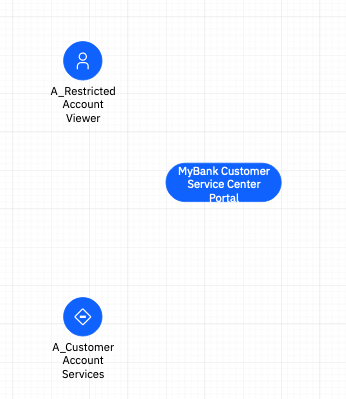
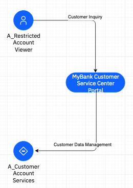
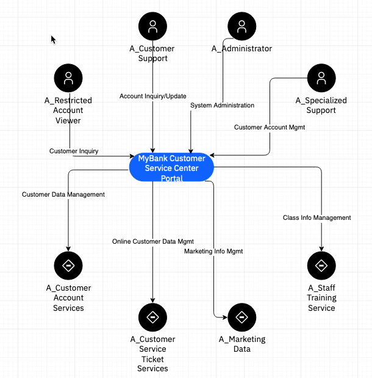

# Solution Design on IBM IT Architect Assistant

## Exercise 1 - System Context Diagram

This is the first in a series of exercises to better understand how to build core artifacts within IBM IT Architect Assistant.  It is not intended to focus on the Solutioning tasks but is focused on the tool usage.

This exercise focuses on building a System Context diagram (SCD) to establish the scope of the target solution being architected. The purpose of the System Context artifact is:

·    To clarify and confirm the environment in which the system has to operate. Once agreed to by the client and the development team, the System Context becomes very useful for maintaining focus on the development effort.

·    To provide the details at an adequate level to allow the creation of the relevant technical specification.

·    Verify that the information flows between the solution to be installed and external entities are in agreement with any business process or context diagrams.

The System Context work product, along with the Non-Functional Requirements and Use-Case Model make up the **requirements** sub-domain for the technical solution. 

## Getting Started

To get started, after logging into IBM IT Architect Assistant, you will need to create a new architecture you will use to work through the tool exercises.

On the private workshop page, hover over the "+" card and click on **Create**.

Enter **MyBank-<your initials>** for the Architecture Name, and enter **MyBank** for the Client Name. Click  **Add**.

The newly created architecture will then open up and you will see the Table of Contents on the left hand navigation area. For this exercise you will be working on the artifact, 2.2 System Context under section 2. Scope.

The purpose of the System Context is to provide the scope for the solution architecture. Namely it defines the solution to be delivered as a **Target System**. It the documents the elements that interface with this Target System.  These external elements are **Actors**.  See [SCD content](https://github.com/IBM/itaa-docs/blob/master/docs/enterprise/Artifact-Details-ITAA.md#system-context) in the tool's user guide for additional guidance. 

Click on the **2.2 System Context** in the Table of Contents to open up the diagram editor.

You will be presented with an error stating that any valid System Context Diagram (SCD) must have a ***Target System*** defined.  You can close the Table of Contents, by clicking on the 'X' next to the ToC title. 

Next notice the drawing palettes along the left side of the drawing canvas. The main palette you will be using is the **System Context Palette**. There are 7 drawing elements presented (2 sets of 3 elements + 1 connector). These two sets represent two different notation styles.  You will work with the "blue" version.

Start by dragging a Target System onto the drawing canvas. With this element placed on the diagram and highlighted you will see metadata properties of the corresponding architecture element displayed in the Attributes tab in the Format panel on the right.  You will be adding details into this tab for most of the drawing elements you add to the diagram. For now, set the name of the Target System to be **MyBank Customer Service Center Portal** and provide a description as:

*An on-demand contact center supporting customer support and marketing operations*

The error message should have disappeared.   This Target System generally wants to be positioned in the middle of your diagram.   It will now be surrounded by identified external entities (Actors).

Add both a Human Actor and an IT System Actor.   

For the Human actor give it the name: **A_Restricted Account Viewer** and description: *This role is able to see a set of account details for a particular customer. Separately it will be determined if the actual user has permissions to view a particular account.*

For the IT System actor give it the name: **A_Customer Account Services** and description: *Systems that store and manage core customer and account data.*

Your diagram should look something like the following at this point.

You will add additional Actors in a bit, but for now, look at Connectors. Start by connecting A_Restricted Account View to the target system. Hover the mouse around the actor.   You should get four (light) arrow arround the actor, when they show, right click and drag to the target system until its border either turns blue or green, then release the mouse.

Do the same, this time starting at the target system and drawing a connector to A_Cusomter Account Services. By default these connectors can remain unnamed.  But often it is a good idea to describe the interaction associated with that connector.   If the description is short, you can just use that for the name.  

Select the connector between Restricted Account View and target system and name it *Customer Inquiry*, and similarly name the other connector, *Customer Data Management*.  By selecting a connector, you can grab and drag the "yellow" dot to reposition the text relative to the connector line.

To fill this out you can optionally add the following additional actors to the diagram along with connectors.

| Actor Type | Actor Name                         | Actor Description                                            | Connector Name            |
| ---------- | ---------------------------------- | ------------------------------------------------------------ | ------------------------- |
| Human      | A_Customer Support                 | Customer support is the role that is able to fully interact with a customer's account information. This role will perform transactions on behalf of the customer and modify the accounts (create new ones, delete accounts, modify terms of accounts) affiliated with a customer. | Account Inquiry/Update    |
| Human      | A_Administrator                    | The role involved in supporting system adminstration tasks related to the Customer Service Portal. | System Administration     |
| Human      | A_Specialized Support              | This role provides customer and bank support activities.  Can support create of and configuration of non-standard Arrangements. | Customer Account Mgmt     |
| IT System  | A_Staff Training Service           | The eLearning Center receives all requests for classes and respond accordingly. | Class Info Mgmt           |
| IT System  | A_Marketing Data                   |                                                              | Marketing Info Mgmt       |
| IT System  | A_Customer Service Ticket Services |                                                              | Online Customer Data Mgmt |

Now for some formatting.  You have lots of options, but let's just focus on the Style properties for now. On the menu, select Edit > Select Vertices. Then deselect just the target system.  Then in the format panel on the right, select the Style tab.  Find toward the bottom, the Property ***Color***. Click on the current Value (Blue) and from the drop-down, select Black.

Click Save.

Continue to explore formatting, moving objects, etc. Save changes when you are happy with things.

[Next Exercise - Ex2 Use Case Model](./Ex2-UCM)
