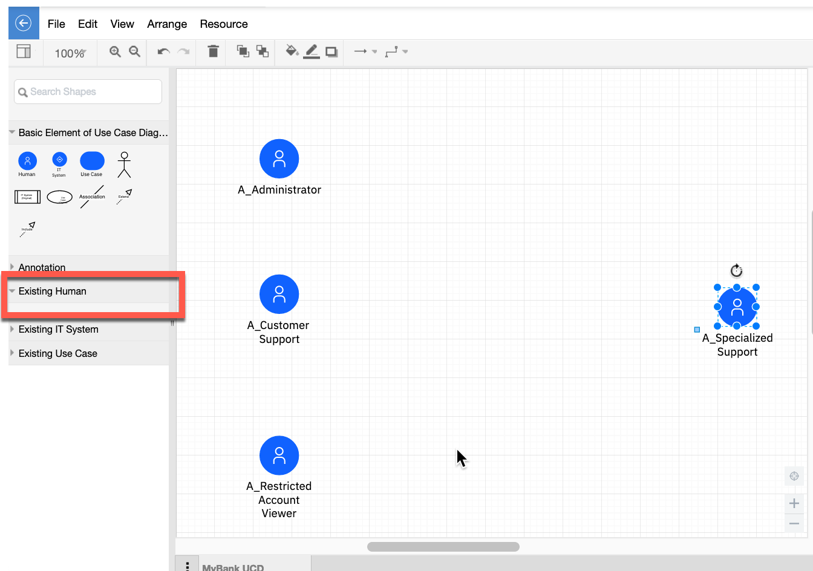
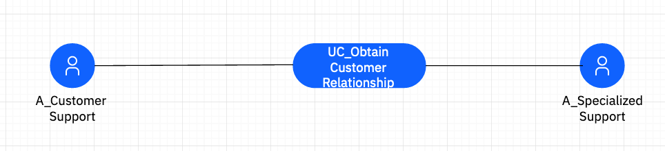
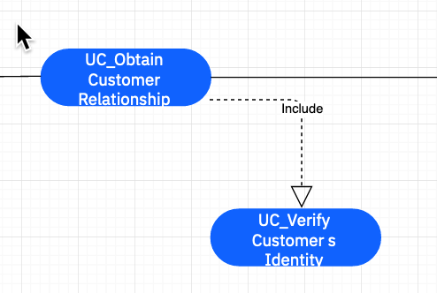
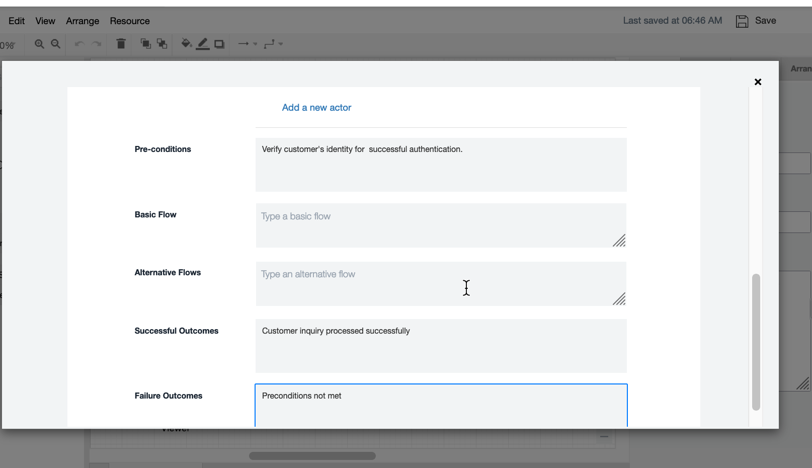
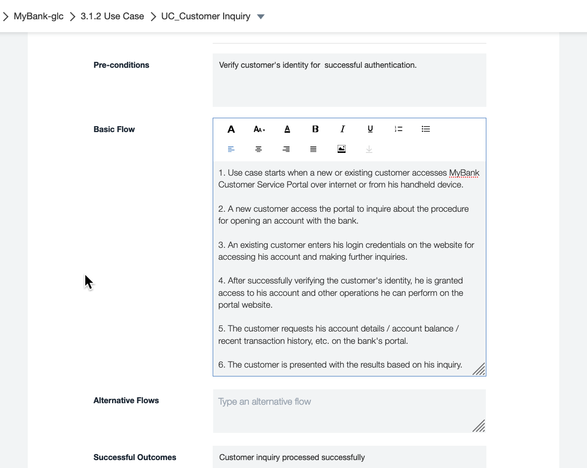

# [Solution Design on IBM IT Architect Assistant](./Solution-Design-ITAA)

## Exercise 2 - Use Case Model

This exercise focuses on building a Use Case Model to drive out key system level functional requirements.

The Use-Case Model, along with the System Context and Non-Functional Requirements make up the **requirements** sub-domain for the technical solution. 

## The Use-Case Model

Within IT Architect Assistant, the Use Case model is comprised to two synchronized artifact types, the Use-Case Diagram and the set of Use Cases.  For a high-level description of manipulating these artifact types within the tool refer to the [User's Guide](../enterprise/Artifact-Details-ITAA#use-cases-and-use-case-diagrams).  

You can approach development of this model from either the perspective of a UC Diagram or from individual Use Cases (form based artifact).  Either way, a diagram represents (shows) a subset of the Use Cases in the model.  In other words you can have multiple Use Case Diagram each organized around a Theme; Subsystem; or set of Actors.

Let's start by working from a diagram and then drop into the Use Case forms to fill in details.

Open your architecture you started working on in Exercise 1. Click on **3.1.1 Use Case Diagram** then Click on **Add Diagram**. In the pop-up, provide the name of **MyBank UCD** and click Create.

On the newly opened diagram, expand the twisty for the **Existing Human** palette.  Drag on the 4 actors and arrange as shown below. Note you are reusing a set of Actors created during the construction of the System Context Diagram.

Next from the Use Case diagram palette, drag a new Use Case onto the canvas. Set the ID, *UC_001* and Name, *UC_Obtain Customer Relationship*. Next set the high-level Description as: *Given Client Account number and Client authentication credential return the set of customer relationships*

With the Use Case selected, open the **Style** tab of the Format Panel. Change the value of the style attribute *Shape (Layout)* to be Expanded instead of Collapsed.  Next you want to show that the Actor, *A_Customer Support* initiates the Use Case and the Use Case is supported by Actor, *A_Specialized Support*. To do this, connect those Actors to the Use Case.

Add the following additional Use Cases to the diagram with the corresponding initiates and supports connections:

| UC ID  | UC Name                                | Description                                                  | Initiator                   | Supporter             |
| ------ | -------------------------------------- | ------------------------------------------------------------ | --------------------------- | --------------------- |
| UC_002 | UC_Obtain Account Information          | Given account number owned by customer, return account information details. | A_Customer Support          | A_Specialized Support |
| UC_003 | UC_Create Service Request              | Initiate a Service Request on behalf of customer.            | A_Specialized Support       |                       |
| UC_004 | UC_Perform System Administration Tasks | System Administator performs scheduled or on request system maintenance activities | A_System Administrator      |                       |
| UC_005 | UC_Customer Inquiry                    | Customer issues inquiry via MyBank Customer Service Portal   | A_Restricted Account Viewer |                       |
| UC_006 | UC_Verify Customer's Identity          | Identity and authentication of customer                      |                             |                       |

Connect UC_006 to UC_001-UC_005 using the *Includes* relationship. Authentication is a critical part of each of the first 5 Use Cases.

**Save** the Diagram.

Before completing this exercise, you will explore the more detailed Use Case artifact instance. There are two ways to access this content and you will explore both approaches.

Click on **UC_005** on the diagram. In the Attributes tab in the Format panel, scroll to the bottom and click on *Go to use case*. A dialog will pop-up with a full set of Use Case attributes. 

Add the following: 

- Pre-conditions -   Verify customer's identity for successful authentication.
- Successful Outcome - Customer inquiry processed successfully
- Failure Outcomes - Preconditions not met

Click **Save** (for the Use Case details)

Click **Save** on the diagram

Next click on the left arrow (upper left) to exit the diagram. Next click on the Table of Contents section 3.2 Use Cases. Locate and Open UC_005.  You should see all of the attributes that you have so far completed for this Use Case.  Add the following for the *Basic Flow*:

1. Use case starts when a new or existing customer accesses MyBank Customer Service Portal over internet or from his handheld device.

2. A new customer access the portal to inquire about the procedure for opening an account with the bank.

3. An existing customer enters his login credentials on the website for accessing his account and making further inquiries.

4. After successfully verifying the customer's identity, he is granted access to his account and other operations he can perform on the portal website.

5. The customer requests his account details / account balance / recent transaction history, etc. on the bank's portal.

6. The customer is presented with the results based on his inquiry.

Click **Save**.

Typically, the Use Case Model is something that gets elaborated throughout the solution design process. It is important to start with those key Use Cases that are important to the solution Stakeholder(s) and collectively help specify the core capabilities delivered by the solution. More detailed Use Cases and/or User Stories will usually be developed further into design. 

[Next Exercise - Ex3 AOD Services View](./Ex3-AOD-Services)