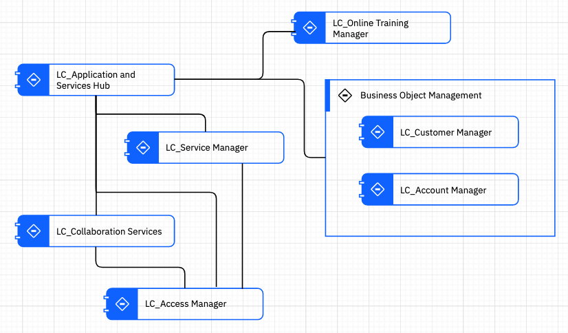
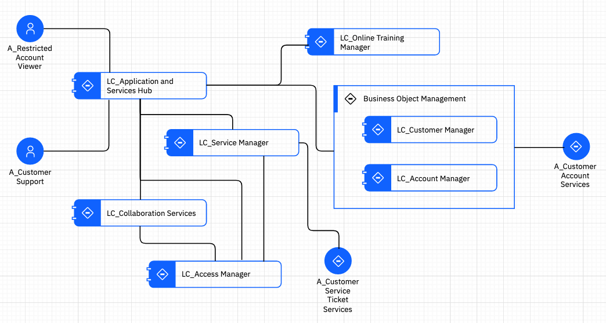
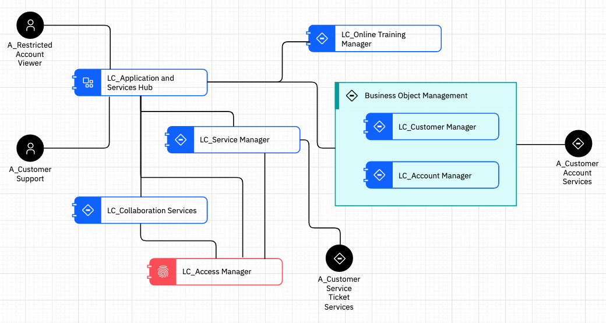

# [Solution Design on IBM IT Architect Assistant](./Solution-Design-ITAA)

## Exercise 3 - AOD Services View

This exercise focuses on building an Architecture Overview Diagram (AOD) focusing on the functional aspects of the system using the AOD Services View. 

An Architecture Overview provides a  high-level description of the solution. It is sometimes likened to the  "back of the envelope" architecture used to create a common understanding and to elicit further conversation to drive out details.  Often several different styles of Architecture Overview Diagram (AOD)  will be employed to communicate different views of the architecture  vision to different stakeholders.

Within IT Architect Assistant the, otherwise freeform, AOD is offered in just three standard styles:

- AOD Services View
- AOD Enterprise View
- AOD IT System View

This standardization is deliberate to make it easier to reuse and compose content.  See [User Guide](../enterprise/Artifact-Details-ITAA#aod-services-view) for more details about these different styled AODs. In addition to these three standard styled AODs, IT Architect Assistant  supports authoring walkthroughs (or Usage Scenarios) as an overlay to  any of the AOD views. This again provides a standard approach to the common practice of describing a Use Case (Usage Scenario) in the context of the solution architecture.

So at this point you will start to describe the shape and decomposition of the solution architecture. The AOD Services View is comprised of *Logical Components*, the primary functional building blocks for the solution, *Subsystems* an organizing and grouping element, and *Logical Connector*s represent interactions between Logical Components (and optionally Actors).

Start by selecting **5.1.1 Services View** in the ToC, then click on **Add Diagram**. Set the name of the diagram to be **MyBank Functional View**, then click **Create**.

Once the diagram opens, drag a Logical Component from the AOD Service Palette onto the diagram.  Set the component's name to be **LC_Access Manager** and description, "*Responsible for supporting authentication and authorization throughout MyBank infrastructure*".  Set the primary capability to be *Security  - IAM*.

Add a Subsystem, name it **Business Object Management**. Add six additional Logical Components: **LC_Collaboration Services**, **LC_Application and Services Hub**, **LC_Services Manager**, **LC_Online Training Manager**, **LC_Customer Manager**, **LC_Account Manager**.  Arrange and connect them similar to below.

Next, add existing Actors onto the diagram placing the A_Restricted Account Viewer and A_Customer Support human actors on the left-side of the diagram.  Add the IT System actor, A_Customer Service Ticket Services toward the bottom and the IT System actor, A_Customer Account Service to the right side. Then connect as shown.

Note that each of the elements on the diagram have an associated icon.  The easiest way to change/customize these icons is to use one or more custom icon palettes.  (For extensive details on how to manipulate these custom palettes, see the [Visualization Guide](../ArchVisualization)).  But, to get started, click on the '+' symbol just to the right of the "search shapes" text box (top of the left side drawing palette area).  For a name for your palette, e.g., MyIcons, and click **Next**. Click on the "Add from IBM standard UI icon set".  Scroll down until you find the section labeled "Technology", and check the checkbox for that group. Click **Apply**, then click **Save**.

Next expand the newly added palette, MyIcons.  Next, locate the fingerprint looking icon in the palette and drag it onto the icon area for the component, LC_Access Manager. Release the mouse button, and the icon should be replaced.  Select other icons to change as you see fit.  

Use the regular Style properties to change actors to be 'black', LC_Access Manager to be 'red' and set subsystem to be 'teal'. Additional information about visualization manipulation can be found in the [User's Guide](../ArchVisualization).

Note adding in detailed descriptions for all of the components and subsystems is essential to helping a reader understand the solution.

You also have the ability to set implementations for these Components. This gets to be very important as you start to create the Bill of Materials (BOM) for the solution.

[Next Exercise - Ex4 AOD IT System View](./Ex4-AOD-IT-System)