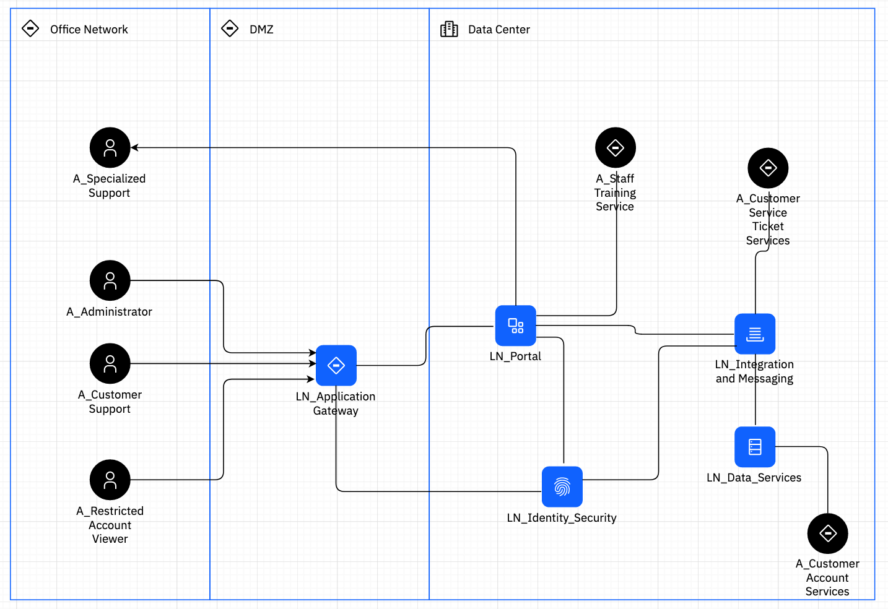
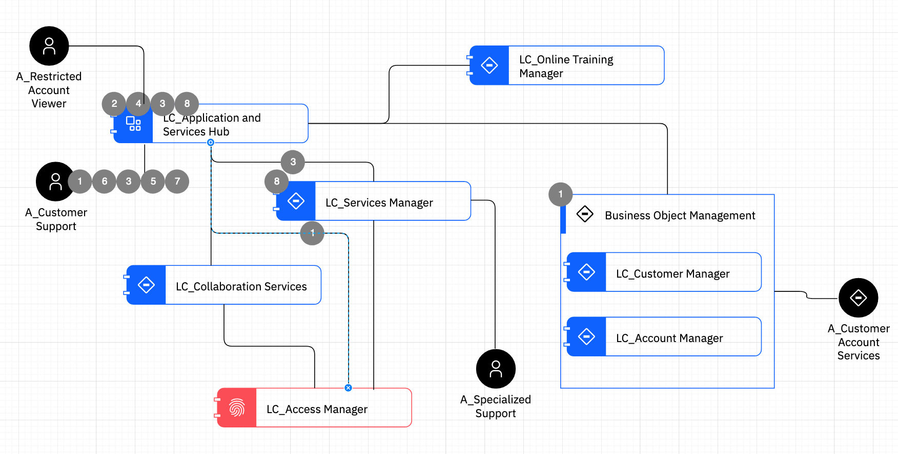
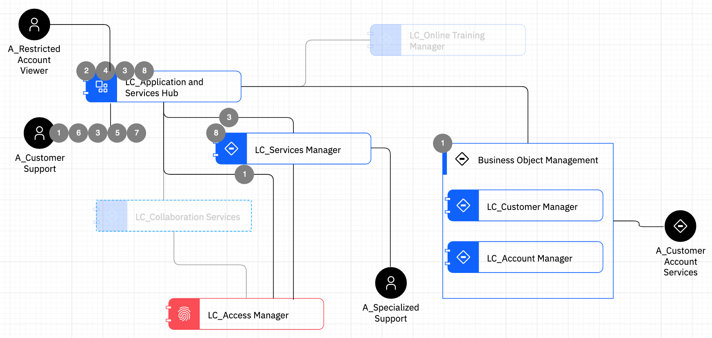

# [Solution Design on IBM IT Architect Assistant](./Solution-Design-ITAA)

## Exercise 4 - AOD IT System View

This exercise focuses on building an AOD that focuses more on the distribution and interaction between the workload elements of the solution via the IT System View.

So at this point you will continue to describe the shape and decomposition of the solution architecture. The AOD IT System View is comprised of *Logical Nodes*, the primary functional building blocks for the solution, *Locations* which represent solution zones, *Subsystems* an organizing and grouping element, and *Logical Connections* representing interactions between Logical Nodes (and optionally Subsystems and/or Actors).

Start by selecting **5.1.3 IT System View** in the ToC, then click on **Add Diagram**. Set the name of the diagram to be **MyBank System View**, then click **Create**.

Next, we will create 3 Locations, representing the office network, the DMZ, and the core data center. Add 3 Locations and name them, **Office Network**, **DMZ**, and **Data Center** respectively, lining them up in that order left to right.  Note these should be sized to be able to easily place Nodes and Actors in them.  Most of our solution elements will be placed in the Data Center location.

Next think about the target audience and the goal for this particular diagram. An IT System View has more of an operational or deployment perspective to it.  This diagram type can show key application-level elements positioned where they will be running. Alternatively, it can focus on the technical elements that support key application-level functionality.  That is the approach we will take here in this example.

Add the following Logical Nodes (see Blue "Generic Node" icon in the palette) into the **Data Center** location: *LN_Portal*, *LN_Identity_Security*, *LN_Data_Services*, *LN_Integration and Messaging*. Next, add another Logical Node named, *LN_Application_Gateway* and place it in the **DMZ** location.

Next add in the available actors, with the Human actors placed in the Office Network location and the IT System actors placed in the Data Center location.  See the diagram below for positioning and connectivity between the architectural elements.

So consider the technical implementation choices, such as what technical service(s) will deliver the integration and messaging capability. You could go ahead and specify these in the **Implementation** attribute for each Logical Node.  In addition, one generally would want to identify, for each Logical Node, which of the Logical Components, defined in the Services Views, are deployed to these nodes. For the set of exercises, we will defer both of these tasks to the more formal Component and Operational Models. In particular in the Operational Model, you can formalize what gets packaged together and deployed onto physical or virtual resources.

### Usage Scenario

A useful activity when assessing a candidate solution architecture, is to "walk-through" the architecture while describing the flow of a key system Use Case.   This is easily documented through the creation of one or more Usage Scenarios.

Consider the main scenario for the Use Case - Create Service Request:

1. Use case starts when CSR selects account number from list. If the  service request is the first action after "Obtain Customer  Relationships", the account number used in that use case will already be selected.
2. System enables list of actions that are valid for this account if other than original account number is selected.
3. CSR selects service request action, in this case schedule a loan closing
4. CSR is prompted with available locations.
5. CSR requests date and location desired from customer
6. CSR selects location calendar and validates date and time are available.
7. CSR enters customer data and confirms scheduling
8. System confirms that request has been accepted. 

Create a Usage Scenario to walk-through this use case "overlayed on the Service View". In the ToC, select, **5.1.4 Usage Scenario** and click on **Add Diagram**. Make sure the Services View, *MyBank Functional View* is selected as the base AOD, and provide the diagram name, **Create Service Request**, click **Create**.

A new Usage Scenario diagram will open up and you will see what appears to be a read-only copy of the Services View you selected as the base AOD.  Click on **Step List** radio button (top-right) to open the Step list for editing. Click Create, set the Name to be 1 and fill in text from above use case step 1 for the description.  Repeat creating steps 2-8.

Next we are going to add the steps to the diagram. First select the connector between A_Customer Support and LC_Application and Services Hub, then in the right-side panel, check the checkbox next to step 1.  Note, you can select an element or connector to associate a step with. Click and associate steps such that your diagram looks like the following:

Given both the flow and the step details, you may want to consolidate steps and clean up the diagram a bit so that the story flows without excessive amount of steps.   The other thing you can control in Usage Scenario diagram is being able to *hide* elements (e.g. subsystems, Logical Components, Logial Nodes). Select LC_Online Training Manger, select the Attributes tab on the right side, and change the slider for Node Status to be disabled.  Do the same for LC_Collaboration Services.  After this, your diagram should look like:

[Next Exercise - Ex5 ADs and Traceability](./Ex5-ADs-Traceability)