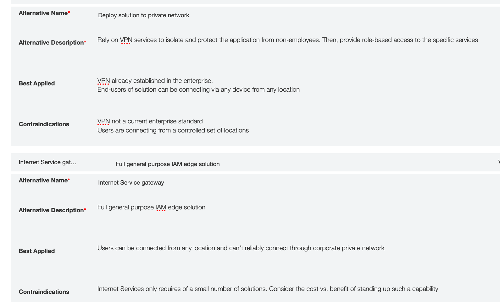
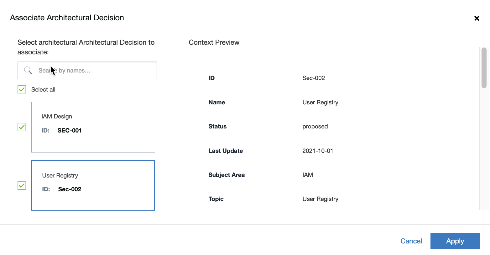
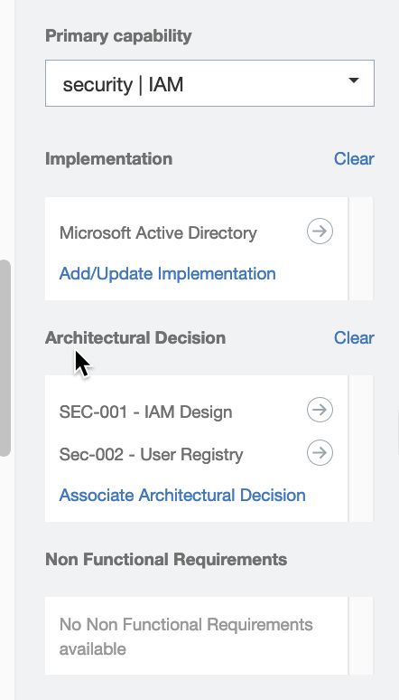

# Design on IBM IT Architect Assistant

## Exercise 5 - Architectural Decision and Traceability

This exercise focuses on documenting key Architectural Decisions and associating them with the aspects of the solution architecture they impact. 

One of the most important elements in documenting a solution architecture is justifying the "Why?". When designing an architecture there are many alternatives to all aspects of the solution. These alternatives include different application patterns down to different implementation / product choices. During the solutioning process and later in technical review, all concerned parties want to have confidence that all reasonable alternatives have been considered and each selection is justified based on requirements, constraints, or some other well-formed decision process. Having this confidence goes a long way to establishing the quality of the solution. Having these "decisions" documented also makes it easy for those assessing the solution at a later time (architects in a different phase of the project, technical reviewers, etc.) to also better understand why the solution looks the way it does and can often avoid unneeded "redesign".

In this exercise, you will create a couple of architectural decisions and then link these and requirements to elements in the architecture, demonstrating the traceability from requirements, through decisions to the actually solution architecture.

The first decision deals with approach for authenticating user identification. It is important in this solution that the system can uniquely identify the customer service employee accessing the system. There are several approaches that could be employed both from a services perspective and a technical approach standpoint. One approach is to fully isolate this solution to only be accessible from a private network. Taking this approach can push the requirement of authentication out to another system, e.g. VPN - to manage access. With this approach we might still need to access simple user registry to establish the unique identity for auditing and role-based permission but not be managing access. Another option is to have the solution accessible to the public network but then have a set of edge security services that manage not only authentication and identity management services but also load balancing, denial of service attack prevention and more.  There are additional big picture alternatives, but let's start with these two and start to document the Architectural Decision.

In your architecture in IBM IT Architect Assistant, click on **5.2 Architectural Decisions** and click on **Add Architectural Decisions**. In the resulting pop-up, enter **SEC-001** for the ID and **IAM Design** for the name, click **Create**.

Fill in the following values for fields:

**Subject Area**: Identity and Access Management

**Topic**: Authentication for Solution

**Issue or Problem Statement**: How to provide access to the solution with certainty of who the user of the system is for any interaction.

**Motivation**:The application provides access to customer sensitive data needed by the Customer Support users to assist customer inquiries. Need to make sure  only authorized individuals have access to this data and also be sure to support auditing who access what data when.

Create your first alternative - click **Create a new Alternative**. Fill in details as shown below (note you will create 2 alternatives to complete this).

The set of attributes filled in thus far is a potentially reusable "guidance", namely here is a typical problem that needs to be solved and a set of alternatives for solving it. Next, you will finish filling out the details of the decision made for this solution.

From the Decision drop-down list, select **Deploy solution to private network**. Then fill in the following remaining attributes with the statements shown below:

**Justification**: A small pool of CSR will be accessing this solution and they have many  other applications they work with which currently require them to have  access to the Private Network.  Currently this solution will NOT be  accessible to a broader set of end-users.

**Implications**: Application must be deployed on the private network.

**Derived Requirements**: Will need to handle access control within the application based on identity.

Click **Save**.

For a second decision, we will consider the service to use for the IAM piece needed by the application for the role-based access control. Create another decision, give it the ID: Sec-002 and Name: User Registry. Provide the necessary attributes and they make sense to you, and have 3 separate alternatives: IBM CLoud AppID, Corporate Microsoft Active Directory instance, and Tivoli Federated Identity Manager.

Next select Corporate Microsoft Active Directory instance, with justification that application running within private network will have direct access to AD.

### Traceability

So the last piece for this exercise is to not just make the Architectural Decisions but to point to them within the solution architecture. Open the AOD IT System View diagram, **MyBank System View**. Then select node **LN_Identity Security**.  In the **Attributes** panel, scroll down and locate **Architectural Decision**.  Click on Associate Architectural Decision. Select both existing decisions and click **Apply**.

Next, click on **Add/Update Implementation**. The current list of Implementations is empty, so click **Create New**. Under Name, enter **Microsoft Active Directory**, click **Apply**. And then click **Apply** to associate the newly created implementation with this node.  

Note that under the **Non Functional Requirement** section it states there are no NFRs available to associate.  Presumably you would have an NFR related to having customer data only accessible to authorized CSRs or similar and this NFR could also be linked to this node.   

Through these attributes (Implementation, Architectural Decision and NFRs), you can provide detailed traceability for why this (in this case) Node appears in the solution as it does.

